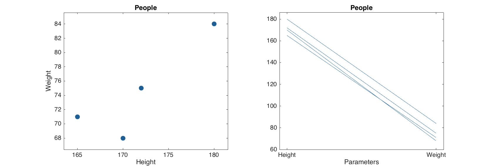

# Quick start guide

This document gives a brief introduction to the basic functionality of mdatools toolbox as well as presents some ideas about how it deals with data, models and results. It is assumed that after reading the text and doing all exercises from the document one can easily start working with toolbox and then learn more features gradually.

## Introduction to datasets

One of the most important things in the MDA toolbox is a dataset object. MATLAB is a great to deal with matrices and arrays, however one has to do a lot of routine operations to represent e.g. matrix values properly. Usually we have names for variables and objects or labels for measurements in our data. However, dealing with the names and labels in MATLAB is not an easy job. One of the ways to solve this issue is to use dataset - a specific object, which is a wrapper for a conventional numeric matrix, giving possibilities to use names more or less easily. Such objects exist in many toolboxes (including Statistics Toolbox) and the mdatools is not an exception here. Moreover, in mdatools dataset is a main way to represent any values. Scores, loadings, residuals, regression coefficients and so on are datasets in mdatools. Therefore is important to start with introduction what dataset is, how to create and manipulate datasets.

Actually in mdatools datasets give a lot more options than just a possibility to have names for rows and columns of a matrix. They allow to hide rows and columns without removing them (for example when one need to remove an outlier or do variable selection), to use qualitative data, factors, for grouping values and do many other things. But in this quick guide we will talk only about most important features of datasets, namely names/labels for rows and columns, making subsets, displaying data values, doing mathematical calculations and making plots.

Dataset can be created from any matrix (array with two dimensions: rows and columns). Actually it is not necessary to provide names for the dimensions. Column names will be generated automatically and row names will remain empty. Here is an example for 3x2 matrix with height and weight values for four persons:

```matlab

values = [180 84; 170 68; 165 71; 172 75];
d = mdadata(values);

show(d)
```

```
 Variables
    1   2
 ---- ---
  180  84
  170  68
  165  71
  172  75
````

Function `show()` displays data values as a table. By default it uses three significant figures but this can be changed by providing extra argument, e.g. `show(d, 5)`.

To specify names for rows and objects one can provide them as a second and third arguments of the `mdadata()` method. The names can be either cell arrays with text values or numeric vectors. Numbers will be converted to text automatically.

```matlab
values = [180 84; 170 68; 165 71; 172 75];
d = mdadata(values, 1:4, {'Height', 'Weight'});
show(d)
```

```
     Variables
   Height  Weight
  ------- -------
1     180      84
2     170      68
3     165      71
4     172      75
```

It is mandatory that row and column names are unique. It is recommended also not to use spaces and other special symbols, especially for column names, to avoid ambiguity. Actually the names may have two forms: full, with spaces and special symbols and short, with only letters and numbers. If one provides names with spaces and special symbols they will be converted to the short form automatically. More on that can be found in the User Guide.

The `mdadata` is a MATLAB object which has several properties and many methods. You can see some of the properties by using `disp()`.

```matlab
disp(d)
```

```
mdadata handle

  Properties:
            name: ''
            info: []
        dimNames: {'Objects'  'Variables'}
          values: [4x2 double]
           nCols: 2
           nRows: 4
        nFactors: 0
        rowNames: {4x1 cell}
        colNames: {'Height'  'Weight'}
    rowFullNames: {4x1 cell}
    colFullNames: {'Height'  'Weight'}
```

The most important ones are `values`, which is a matrix with data values, `rowNames` - cell array with row names and `colNames` - cell array with column names. All three can be changed manually for the whole object or for particular rows or columns. You can also specify a name for the dataset, short information text and labels for each of the two dimensions. Here are some examples:

```matlab
d.rowNames = {'Lars', 'Peter', 'Anna', 'Kim'};
show(d)
```
```
         Variables
       Height  Weight
      ------- -------
 Lars     180      84
Peter     170      68
 Anna     165      71
  Kim     172      75
```


```matlab
d(1, :).rowNames = 'Mike';
show(d)
```
```
         Variables
       Height  Weight
      ------- -------
 Mike     180      84
Peter     170      68
 Anna     165      71
  Kim     172      75
```


```matlab
d.name = 'People';
d.info = 'People data for quick start guide';
d.dimNames  = {'Persons', 'Parameters'};
show(d)
```
```
People:
People data for quick start guide

         Parameters
       Height  Weight
      ------- -------
 Mike     180      84
Peter     170      68
 Anna     165      71
  Kim     172      75
```
You can subset datasets using the same way as with matrices: by specifying indices for rows and columns. All special names and symbols, like : and end will work properly. Alternatively column and row names can be used for the same purpose.

```matlab
show(d(1:2, :))
```
```
People:
People data for quick start guide

         Parameters
       Height  Weight
      ------- -------
 Mike     180      84
Peter     170      68
```

```matlab
show(d({'Mike', 'Anna'}, 'Height'))
```
```
People:
People data for quick start guide
      Height
     -------
Mike     180
Anna     165
```

The `mdadata` class has most of the standard mathematical and statistical methods overridden. This means that you can work with datasets just as with conventional matrices in MATLAB. Result of any operation is also a dataset (object of class `mdadata`). For example, let's calculate BMI index for our data values.

```matlab
bmi = d(:, 'Weight') ./ (d(:, 'Height') / 100) .^ 2;
bmi.colNames = 'BMI';
show(bmi)
```
```
        BMI
      -----
 Mike  25.9
Peter  23.5
 Anna  26.1
  Kim  25.4
```

## Simple plots

The `mdadata` also overrides some plotting methods, including `scatter()`, `plot()`, `bar()` and several others. Besides that, statistical plots, such as `hist()`, `boxplot()` and `qqplot()`. It means that if one provided an `mdadata` object as a first argument for these functions, a specially written version will be used instead of conventional MATLAB method. Thus to make a scatter plot one has to provide a dataset with one or two columns. If more than two are available, `scatter()` method will ignore them.

```matlab
figure
subplot(1, 2, 1)
scatter(d)
subplot(1, 2, 2)
plot(d)
```



As you can see the labels for axes, ticks, as well as title for the plot were set using dataset names. Color of data points, lines and bars are selected automatically but one can specify these and several other most important parameters for each plot. There are also additional options, allowing, for example, color grouping of data points and lines according to a vector of values. Look at description of plotting methods for the `mdadata` class for details. One of the most useful option is a possibility to show labels for data points or bars. Labels can be names (`'names'`), numbers (`'numbers'`) or values (`'values'`, this can be used only with bar plot).

```matlab
figure
subplot(1, 2, 1)
scatter(d, 'Marker', 'd', 'Color', 'g', 'Labels', 'names')
subplot(1, 2, 2)
bar(d('Mike', :), 'FaceColor', 'b', 'Labels', 'values')
```


## Univariate statistics

There are several statistic methods also available for the mdadata datasets. To demonstrate this we will use a subset of dataset *People*, which is provided with the toolbox. In the dataset there are values for 32 persons from scandinavian and medditeranian regions (50% males, 50% females). Here are some examples.

```matlab
load('people')
d = people(:, {'Height', 'Weight', 'Shoesize'});
show( d(1:5, :) )
```
```
People:
People dataset

               Variables
        Height  Weight  Shoesize
       ------- ------- ---------
  Lars     198      92        48
 Peter     184      84        44
Rasmus     183      83        44
  Lene     166      47        36
 Mette     170      60        38
```

```matlab
show( mean(d) )
```
```
             Variables
      Height  Weight  Shoesize
     ------- ------- ---------
Mean     173    64.5      39.9
```

```matlab
show( std(d) )
```
```
             Variables
       Height  Weight  Shoesize
      ------- ------- ---------
Stdev    10.1    15.2       3.9
```

```matlab
show( se(d) )
```
```
                   Variables
            Height  Weight  Shoesize
           ------- ------- ---------
Std. error    1.78    2.69     0.689
```

```matlab
show( percentile(d, 25) )
```
```
Percentiles:

            Variables
     Height  Weight  Shoesize
    ------- ------- ---------
25%     164      50        36
```

```matlab
show( summary(d) )
```
```
Summary statistics:

               Variables
        Height  Weight  Shoesize
       ------- ------- ---------
   Min     157      46        34
    Q1     164      50        36
Median     174    64.5        40
  Mean     173    64.5      39.9
    Q3     180    80.5        43
   Max     198      92        48
```

As well as several statistical plots.

```matlab
figure
subplot(2, 2, 1)
hist( d(:, 'Height') )
subplot(2, 2, 2)
qqplot( d(:, 'Height') )
subplot(2, 2, 3)
boxplot( d )
```


We hope that this brief overview of `mdadata` class gave an overall impression on how it works and how to use it for storing and visualisation of data values. To learn more, please, look at the User Guide and full description of the `mdadata` class and its methods.

## Principal component analysis

The next step is to learn how to build and use models in `mdatools`. We will employ PCA to demonstrate the most important things, as we believe it is most known, and then will show some pecularities and issues on how this methodology works with regression models.

The basic idea behind creating and using any model is following. For most of the methods, mdatools has two classes (objects). One for model, that can be calibrated using this method, and one for result of applying this model to any dataset(s). The first (model) object has properties related to the model only. The second (result) object, contains properties related to the results. Thus for PCA model contains: loadings and their eigenvalues, number of components, which preprocessing methods to use and so on. The PCA result object mainly contains: scores, variance, and Q2/T2 residuals.

Of course the results of calibration, cross-validation or test-set validation are also part of a model. Therefore any model may have three result objects, as the model properties. One for calibration set (calres) is always exist, since it is not possible to make a model without calibration set. The other two, cvres and testres, are optional and are empty if none of the validation methods is used.

Any model and result object has also methods for making various plots and showing statistics. Thus method plotscores() for result object shows scores only for particular results. But the same plotscores() method being called for a model will show scores for each of the results available. The same for, e.g. explained variance. Method plotexpvar() shows explained variance for each component either for particular result or for the whole model (calibration, test and cross-validation if last two are available).

Let's look how to make and explore PCA model and results using the People data.

   load('people')
   m = mdapca(people, 6, 'Scale', 'on');
   disp(m)
   disp(m.calres)
  mdapca handle

  Properties:
           info: []
          nComp: 6
       loadings: [12x6 mdadata]
    eigenvalues: [6x1 mdadata]
           prep: [1x1 prep]
          alpha: 0.05
             cv: []
         calres: [1x1 pcares]
          cvres: []
        testres: []
         limits: [2x6 mdadata]
         method: 'svd'


  pcares handle

  Properties:
        info: 'Results for calibration set'
      scores: [32x6 mdadata]
    variance: [6x2 mdadata]
    modpower: [32x6 mdadata]
          T2: [32x6 mdadata]
          Q2: [32x6 mdadata]


As you can see, indeed the m object has mdapca class and containes, among others, loadings of the principal component space. It also has three objects with results: calres, cvres and testrest but the last two are empty, since we did not use any validation here.

For cross-validation one need to specify parameter 'CV' with cell array as a value. The first element of the cell array is how to split data. Possible values are 'rand' for random splits, 'ven' for systematic (venetian blinds) splits and 'full' for full cross-validation (leave-one-out). For the first two one can specify a second value which is number of segments to split the data into. Finally, for the random splits, we can also specify a number of repetitions. Thus the following example will make cross-validation with random splits to eight segments and four repetitions.

   load('people')
   m = mdapca(people, 6, 'Scale', 'on', 'CV', {'rand', 8, 4});
   disp(m)
  mdapca handle

  Properties:
           info: []
          nComp: 6
       loadings: [12x6 mdadata]
    eigenvalues: [6x1 mdadata]
           prep: [1x1 prep]
          alpha: 0.05
             cv: {'rand'  [8]  [4]}
         calres: [1x1 pcares]
          cvres: [1x1 pcares]
        testres: []
         limits: [2x6 mdadata]
         method: 'svd'


Now model contains two types of results which are not emplty - calres and cvres.

How to explore models and results? All numerical values are available as mdadata objects, so if you want to look at e.g. scores for the first five rows of calibration set, just use

   show(m.calres.scores(1:5, :))

Scores:

                          Components
        Comp 1  Comp 2  Comp 3  Comp 4  Comp 5  Comp 6
       ------- ------- ------- ------- ------- -------
  Lars   -5.33  -0.677    1.07     1.1   -1.06   0.017
 Peter   -3.11  -0.293  -0.671   -1.31  -0.435  -0.119
Rasmus      -3   -0.36  -0.212   -1.12  -0.204  0.0166
  Lene    1.08   -1.84  -0.409  -0.123    1.32  -0.872
 Mette   0.981   -1.43   -1.65   0.526  -0.714  0.0346

However it is much easier with plots. Here is how to show summary and plot overview for a PCA model:

   summary(m)
   figure('Position', [100 100 800 500])
   plot(m)
        Eigenvalues  Expvar  Cumexpvar  Expvar (CV)  Cumexpvar (CV)
       ------------ ------- ---------- ------------ ---------------
Comp 1         6.43    53.6       53.6         45.5            45.5
Comp 2         2.24    18.7       72.3         17.8            63.3
Comp 3         1.62    13.5       85.7         14.4            77.7
Comp 4        0.998    8.32       94.1         13.3              91
Comp 5        0.319    2.66       96.7         3.36            94.3
Comp 6        0.165    1.38       98.1         1.87            96.2


If one need to look at the scores and loadings for other set of components, just specify this as a second argument:

   figure('Position', [100 100 800 500])
   plot(m, [1 3])

Examples of how to use scores and loadings with additional options

   figure('Position', [100 100 800 500])

   subplot(2, 2, 1)
   plotscores(m, 1, 'Labels', 'names')

   subplot(2, 2, 2)
   plotscores(m, [1 3], 'Marker', 's', 'Color', 'g')

   subplot(2, 2, 3)
   plotloadings(m)

   subplot(2, 2, 4)
   plotloadings(m, [1 3], 'Labels', 'names')

Scores are not calculated for the cross-validated results, so they are not shown on the plot. In the current version scores for model can be plotted as scatter or density scatter plot. Loadings can be shown as scatter, line and bar plot.

   figure('Position', [100 100 800 500])

   subplot(2, 1, 1)
   plotloadings(m, 1, 'Type', 'line', 'Marker', '.')

   subplot(2, 1, 2)
   plotloadings(m, [1 2], 'Type', 'bar')

Examples for residuals:

   figure('Position', [100 100 800 300])

   subplot(1, 2, 1)
   plotresiduals(m, 'Labels', 'names', 'Marker', 's')

   subplot(1, 2, 2)
   plotresiduals(m, 2, 'Labels', 'names', 'Marker', 'sdo', 'Color', 'rgb')

Since cross-validated values can be shown on residuals plot (as well as test set results) here we need to specify color or/and marker either one for all results, as it is done in first plot, or three (one for each type) as in the second plot.

One can also make similar plots for any results. One important feature of e.g. scores and residuals plots for the results is that they can be colorised by any vector of values. For model plots this option is not available, since color is used to separate type of results, but here we can do it easily using specific options.

   figure('Position', [100 100 800 300])

   subplot(1, 2, 1)
   plotscores(m.calres, 'Labels', 'names')

   subplot(1, 2, 2)
   plotscores(m.calres, 'Labels', 'names', 'Colorby', people(:, 'Beer'))

Thus in the second plot data points are colorised according to annual beer consumption by the persons and one can also see a colobar with legend.

More details about PCA model and result objects and methods can be found in class descriptions (mdapca and pcares).

Working with images
The mdatools may work naturally with images. Image can be represented as a 2-way dataset by unfolding 3-way cube, so all pixels become rows (objects) and all channels - columns (variables). In mdatools there is a specific object to work with images, mdaimage. It is based on mdadata class and inherits all its properties and methods. So all examples above will also work with mdaimage obects.

However there are also some important things to know. First of all image has no row names, since number of pixels is very large, it would slow manipulations with such objects if we used names. Second difference is when you subset an mdaimage you have to use three indices: width, height and channels. Finally mdaimage has a method imagesc() allowing to show an image for any channel. Let's play with that:

   img = imread('test.jpg');
   img = mdaimage(img, {'Red', 'Green', 'Blue'});
   disp(img)

   % show color values for 3x3 pixels from left top corner
   show(img(1:3, 1:3, :))
  mdaimage handle

  Properties:
           width: 400
          height: 285
           image: [285x400x3 double]
            name: ''
            info: []
        dimNames: {'Pixels'  'Channels'}
          values: [114000x3 double]
           nCols: 3
           nRows: 114000
        nFactors: 0
        rowNames: {}
        colNames: {'Red'  'Green'  'Blue'}
    rowFullNames: {}
    colFullNames: {'Red'  'Green'  'Blue'}


      Channels
  Red  Green  Blue
 ---- ------ -----
  183     80   101
  191     76   105
  187     73    99
  187     77   102
  185     75   102
  183     73   100
  183     73   100
  182     72    97
  223    119   142

Method imagesc shows images for separate channels. If it is needed to show a color image, use .image property, but do not forget to scale intensities, since all values of mdaimage are double.

   figure

   subplot(2, 2, 1)
   imagesc(img(:, :, 'Red'))
   title('Red')

   subplot(2, 2, 2)
   imagesc(img(:, :, 'Green'))
   title('Green')

   subplot(2, 2, 3)
   imagesc(img(:, :, 'Blue'))
   title('Blue')

   subplot(2, 2, 4)
   imshow(img.image/255)
   title('Color image')

   colormap(gray)

Since image is just an extension of mdadata it can be treated as a just a dataset, e.g. here is how to make a density scatter plot.

   figure
   densscatter( img(:, :, {'Red', 'Blue'}));

When one make a PCA model for an object of mdaimage class, all results for objects (pixels), such as scores and residuals will be automatically converted to mdaimage objects as well. It means, we can make scatter image for particular component.

   m = mdapca(img);

   figure('Position', [100 100 800 300])

   subplot(1, 2, 1)
   plotscores(m.calres, 'Type', 'densscatter');

   subplot(1, 2, 2)
   imagesc(m.calres.scores(:, :, 2));

GUI Tools
The toolbox has also GUI for interactive exploration of data and models. Currently it is in alpha version and can only work with datasets. To run the GUI (it is called explorer in mdatools) just use:

   explore(people);

The window is split into several parts with three plots and panels with parameters on right side. The parameters include settings for the current plot (plot type and various options) and preprocessing. Background of a panel with current plot is highlighted with light bage color. To change the current plot just click on a panel (gray area outside axes) of the plot you want to change to.

For any dataset there are two designated variables (columns). The first is used to make one-variable plots like histogram, QQ-plot, etc. The second is used to make scatter plot. The designated variables are shown with gray dashed lines on a line plot. Their position can be changed using arrows (left/right for first and up/down for second).

For scatter, line and image plots it is possible to select objects or variables, exclude them, show excluded variables and include them back. The procedure is similar for all plots, so only selecting objects on scatter plot will be explained below.

To select points on scatter plot do:

Select panel with scatter plot.
Push "s" button on keyboard, so a cursor looks like a cross.
Make a closed polygon around points you need to select.
If needed change polygon shape using nodes.
Double click inside polygon to make selection.
The selected points are highlighted with color. All other plots, like e.g. line plot or histogram will be shown only for selected objects. To unselect objects use "Esc" button. It also can be used if you started selection but would like to stop without selecting objects.

Other important shortcuts are:

"e" to exclude selected objects
"a" to add excluded objects back
"i" invert current selection
If you want to add some of the excluded objects back, you need to make them visible using plot options (e.g. "Excluded rows"), then select them and push key "a". All operations with selected objects, e.g. inverting selection, excluding, including, etc. are also available from context menu (use right mous button with cursor on selected objects or variables).

Data can be also preprocessed directly in the explorer. To define a sequence of preprocessed methods select method from a list and click "Add". Icons with errors (up/down) can be used to change the position of a method in the sequence and cross icon removes the method. Names of methods, which have additional settings (e.g. Savitzky-Golay) are shown as blue hyperlinks. By clicking on the link one can get a modal window with the settings, change and save them. Finally two buttons at the bottom of this section allow to apply the preprocessing sequence to the data and reset data to original state.