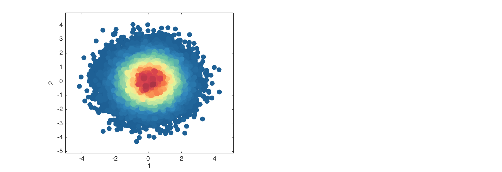

# Making simple plots

One can make simple plots with `mdadata` objects in a similar way as it is done for ordinary matrices and vectors in Matlab. However, using the datasets gives you extra possibilities, such as having automatic titles for axes, labels for data objects (markers, bars, etc.), legends when making group plots, etc. Below we consider simple graphical methods and in the next two sections more advanced methods will be explained.

In most of the methods, it is considered that columns represent variables and rows represent observation. Transpose your data if it is opposite. The list of methods for making simple plots includes `scatter()`, `densscatter()`, `plot()`, `bar()`, `levelplot()`, `matrixplot()`, `hist()`, `errorbar()`, `boxplot()` and `qqplot()`.

## Scatter plots

Scatter plots can be make with method `scatter()`, however it utilises the Matlab's built-in function `plot()`, since it works much faster when number of observations is large. One can use all parameters of the standard `plot()` to tune the result.

To make the scatter plot for pairs *(x, y)* user should provide a dataset with at least one column as a first argument. If exactly one column is used, the *x* values will be generated as a sequence from 1 to *N*, where *N* is number of observations.

```matlab
load people

figure
scatter(people(:, 1:2), 'Marker', 's', 'MarkerFaceColor', 'c');
```


If more than two columns are provided, the method will show the plot for the first two and ignore the other columns. Labels of objects can be shown either as names (if provided) or as numbers:

```matlab
figure
subplot(1, 2, 1)
scatter(people(:, 1:2), 'Labels', 'names');
subplot(1, 2, 2)
scatter(people(:, 1:2), 'Labels', 'numbers');
```


Besides that, the `scatter()` method allows grouping the data points by colors. Parameter `'Colorby'` allows making a color grouping by a vector with numeric values or one of the columns of the dataset. Column name or number should be specified as the parameter value in latter case.

```matlab
figure

% group by numeric values
v = people(:, 'Beer').values;
subplot(1, 3, 1)
scatter(people(:, 1:2), 'Colorby', v);

% group by logical values
subplot(1, 3, 2)
scatter(people(:, 1:2), 'Colorby', v > 300);

% group by one-column mdadata object
subplot(1, 3, 3)
scatter(people(:, 1:2), 'Colorby', people(:, 'Beer'));
```


The grouping can be tuned by setting another color map (parameter `'Colormap'`), adding a color bar legend (`'Colorbar'`) and title for the color bar (`'ColorbarTitle'`):

```matlab
figure

subplot(1, 2, 1)
scatter(people(:, 1:2), 'Colorby', people(:, 'Beer'), 'Colorbar', 'on');

subplot(1, 2, 2)
scatter(people(:, 1:2), 'Colorby', people(:, 'Beer'), 'Colormap', @gray,...
      'Colorbar', 'on', 'ColorbarTitle', 'Beer consumption (L/year)');
```


# Density scatter plots

The density scatter plot is an extension of scatter plot, where data points are colored according to density of area around them (how many neighbors they have. The plot is useful when it is needed to detect patterns in a data with thousands of objects.

```matlab
data = mdadata(randn(50000, 2));

figure
densscatter(data);
```


Additional parameters allow to change area of neighborhood the density is calculated for and change color map as it can be done with `scatter()`.

```matlab
figure

subplot(1, 3, 1)
densscatter(data);

subplot(1, 3, 2)
densscatter(data, 'NBins', 30);

subplot(1, 3, 3)
densscatter(data, 'Colormap', @spring);
```



# Line plots

Method `plot()` is used to make line plots, very much similar to how it works with standard Matlab function. By default the values for x axis are generated as a sequence from 1 to N, where N is number of columns (variables) in the dataset. Every observation is shown as a line.

In the example below we will be using another data set, `'simdata'`, which includes UV/Vis spectra and concentration map of mixings of three polyaromatic hydrocarbons. There are two data items: `'spectra'` with spectral values, and `'conc'` with concentrations.

```matlab
load simdata

figure
plot(spectra, 'Color', 'r')
```

If it is needed to use specific values for the x, they can be provided as a second argument and can be either a numeric vector or `mdadata` object with one column and the same values as number of columns in original dataset.

```matlab
figure

% use channel numbers
subplot(2, 1, 1)
plot(spectra, 1:151, 'Color', 'b')
xlabel('Wavenumbers')

% convert nm to cm-1
nm = str2num(cell2mat(spectra.colNames'));
invcm = 10^7 ./ nm;

subplot(2, 1, 2)
plot(spectra, invcm, 'Color', 'r')
xlabel('Wavelength, cm-1')
```

Finally, the method allows to make color grouping of the lines, using the same way and parameters as `scatter()`. Below we will colorize the spectra according to the concentration of first component of the mixtures.

```matlab
figure

subplot(2, 1, 1)
plot(spectra, 'Colorby', conc(:, 1))

subplot(2, 1, 2)
plot(spectra, 'Colorby', conc(:, 1), 'Colorbar', 'on', ...
    'ColorbarTitle', 'Concentration of C1')
```

# Bar plots

Bar plots are used to show the values for a particular row of a dataset. Let us imagine that we have a explained variance values for PCA decomposition:

```matlab
expvar = mdadata([45.6 24.1 9.71 5.63 3.1; 43.4 21.1 9.63 4.12 2.2]);
expvar.rowNames = {'Calibration', 'Test'};
expvar.colNames = 1:5
expvar.dimNames = {'Results', 'Components'};
expvar.name = 'Explained variance, %';

show(expvar)
```
```
Explained variance, %:

                     Components
                1     2     3     4    5
            ----- ----- ----- ----- ----
Calibration  45.6  24.1  9.71  5.63  3.1
       Test  43.4  21.1  9.63  4.12  2.2
```

This code will show the bar plot for selected row:

```matlab
figure
bar(expvar('Test', :), 'FaceColor', 'r')
```

Labels can be show on the top of each bar, the actual y values are used for the labels. You can specify significant figures for the label values using parameter `'LabelsSigfig'`.

```matlab
figure
subplot(1, 2, 1)
bar(expvar('Test', :), 'Labels', 'values')
subplot(1, 2, 2)
bar(expvar('Test', :), 'Labels', 'values', 'LabelsSigfig', 2)
```

# Level and matrix plots

These two simple plots can be used to overview of all values at the same time. The level plot shows values as a set of rectangles, color of each correspond to a value it represents. A color pallette can be changed by the standard colormap() function and colorbar can be added to see the color map to the values. The method can be particularly useful for visualising data of the same origin (unites) or pairwise data, for example correlation matrix.

   figure('Position', [0 0 400 300]);
   levelplot(people(1:5, 1:5))

   figure('Position', [0 0 400 300]);
   levelplot(corr(people(1:5, 1:5)), 'Colormap', @jet)
   colorbar
 
The matrix plot does almost the same, but shows values as a 3D surface instead of flat set of rectangles. The method uses standard function mesh() to make the plot.

   figure('Position', [0 0 500 300]);
   matrixplot(people(1:5, 1:5), 'Colormap', @jet)
   colorbar

Statistics plots
There is also a family of plots for statistical analysis, including distribution histogram (hist()), error bar plot (errorbar()], box and whiskers plot (boxplot()) and quantile-quantile normal plot (qqplot()).

The histogram plot shows density or frequency distribution for a selected column of a dataset. All parameters from standard bar() function can be used. The histogram bars are made partly transparent to be in contrast with normal distribution curve (if shown), this can be changes using parameter 'FaceAlpha'. The parameters of the curve, such as 'Color', 'LineStyle' and 'LineWidth' can be also changed.

   figure('Position', [0 0 800 300])

   subplot(1, 2, 1)
   hist(people(:, 'Height'), 'FaceColor', 'r', 'FaceAlpha', 1)

   subplot(1, 2, 2)
   hist(people(:, 'Height'), 5, 'Density', 'on', 'ShowNormal', 'on', 'Color', 'r')

The errobar plot shows average values and error bars for each of the dataset columns. The error bars are calculated by default as 95% confidence intervals for mean values, based on Student's t-distribution, but this can be changed to standard error, standard deviation or one of these with a factor of desired probability. Most of the parameters for standard plot() function can be used.

   d = people(:, {'Height', 'Weight', 'Beer', 'Wine'});

   figure('Position', [0 0 900 600])

   % error bars show 95% confidence interval for mean
   subplot(3, 2, 1)
   errorbar(d, 'Color', 'r')

   % error bars show 90% confidence interval for mean
   subplot(3, 2, 2)
   errorbar(d, 'Alpha', 0.10)

   % error bars show one standard error (+/-)
   subplot(3, 2, 3)
   errorbar(d, 'Type', 'se')

   % error bars show one standard deviation (+/-)
   subplot(3, 2, 4)
   errorbar(d, 'Type', 'std')

   % error bars show interval for 90% of most common values
   subplot(3, 2, 5)
   errorbar(d, 'Type', 'std', 'Alpha', 0.10)

The box and whiskers plot shows quartiles of the dataset columns as well as minimal and maximal values for outliers free data. The outliers are detected as values exceeding q3 + w(q3 - q1) or beneath q1 - w(q3 - q1). Here q1 is first quartile, q3 is the third quartile and w is a parameter, which can be changed using 'Whisker' option. The default value for w is 1.5 which gives interval about +/- 2.7 standard deviations for normally distributed data. The detected outliers are shown as separate points. Option ShowLabels let the method show labels (object names) for the outliers.

   d = people(:, {'Height', 'Weight', 'Swim'});

   figure('Position', [0 0 900 300])

   subplot(1, 3, 1)
   boxplot(d)

   subplot(1, 3, 2)
   boxplot(d, 'Whisker', 1, 'Color', 'r', 'EdgeColor', 'k')

   subplot(1, 3, 3)
   boxplot(d, 'Whisker', 1, 'Labels', 'names')

Quantile-quantile plot for normal distribution calculates real and theoretical quantiles of each data point as if the values are distributed normally. The calculated values are shown as a scatter plot and can be used to evaluate if data is distributed normally or deviates from normal distribution.

As e.g. hist() method it shows plots for the first 12 columns in the dataset.

   figure('Position', [0 0 900 300])

   subplot(1, 2, 1)
   qqplot(people(:, 'Height'))

   subplot(1, 2, 2)
   qqplot(people(:, 'Height'), 'Labels', 'on', 'ShowNormal', 'off')
