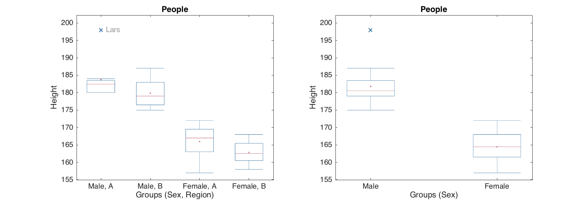

# Group plots

Factors can also be used when making both statistical and conventional plots. In this section we will look at the basic principles that work similar for any group plots and additional possibilities of conventional plots.

## Statistical group plots

With statistical plots it works the same way as with calculation of qualitative statistics: instead of original variables (columns) methods use values of one variable, which is split into groups according to a combination of factors specified by user.

The syntax for plotting methods is therefore very similar to the methods for calculation of statistics: first argument is a dataset with values and second argument should be a dataset with one or more factors. If data object has more than one column, several subplots (up to 12) will be shown on the same figure. Here are some examples.

To show how it works for histograms, let us generate a dataset, where first variable will contain normally distributed random values from two distributions, second variable will contain uniformly distributed random values from two distributions, and the third will be a factor telling which distribution the values come from.

```matlab
n = 1000;
v1 = [randn(n, 1); randn(n, 1) + 2];
v2 = [rand(n, 1); rand(n, 1) + 0.3];
v3 = [ones(n, 1); zeros(n, 1)];

data = mdadata([v1 v2 v3]);
data.factor(3);
```

The grouped histogram plot for one variable can be made as following.

```matlab
figure
subplot 121
hist(data(:, 1), data(:, 3), 'ShowNormal', 'on');
subplot 122
hist(data(:, 1), data(:, 3), 15, 'ShowNormal', 'on', 'FaceAlpha', 0.3);
```


If one uses more than one quantitative variable, the method will take the first and ingore the others. Since in histogram plot color is used to separate the distribution of the groups, the color parameters such as, for example, `'FaceColor'` should contain as many color values as many groups.

```matlab
figure
hist(data, data(:, 3), 25, 'ShowNormal', 'on', 'FaceColor', 'rb');
```


Now let us get back to the *People* data and set up some factors.

```matlab
load people

people.factor('Sex', {'Male', 'Female'});
people.factor('Region', {'A', 'B'});
```

Error bar plot for one variable is made in the same way, just use syntax and parameters as usual, but second argument should be a dataset with factors.

```matlab
figure
subplot 121
errorbar(people(:, 'Height'), people(:, {'Sex', 'Region'}), 'Type', 'std', 'Alpha', 0.1);

subplot 122
errorbar(people(:, 'Height'), people(:, {'Sex', 'Region'}), 'Alpha', 0.1);
```


Box and whiskers plot.

```matlab
figure
subplot 121
boxplot(people(:, 'Height'), people(:, {'Sex', 'Region'}), 'Labels', 'names');

subplot 122
boxplot(people(:, 'Height'), people(:, {'Sex'}), 'Whisker', 1);
```



Quantile-Quantile normal plot.

```matlab
figure
subplot 121
qqplot(people(:, 'Height'), people(:, {'Sex', 'Region'}), 'Labels', 'names');

subplot 122
qqplot(people(:, 'Height'), people(:, {'Sex'}));
```


## Conventional group plots

The basic conventional plots `scatter()`, `plot()` and `bar()` also can work with factors and groups. However in contrast to statistical plots here it was decided to use separate methods in order to extend their functionality. The methods for group plots have a leading `'g'` in the function name: `gscatter()`, `gplot()` and `gbar()`. One can think about group plots as following: if a plot needs a legend, it is a group plot.

The groups on these plots are separated first of all using different colors. Because of that, color gradient (option `Colorby`) is not available for group plots. Besides that, one can change marker and line properties for each group. However in this case you need to specify as many values, as many groups you have. Let's look at some examples.

The bar plot is a specific one, the only possibility to make a group bar plot is to provide a dataset with several rows. While `bar()` makes separate plot for each row, the `gbar()` method will make a single plot with several bar series separated by colors as it is shown below.

```matlab
% set up a data with explained variance for PCA model
expvarcal = [0.54 0.25 0.13 0.09];
expvarcv = [0.49 0.19 0.15 0.12];
data = mdadata([expvarcal; expvarcv]);
data.rowNames = {'Cal', 'CV'};
data.colNames = {'PC1', 'PC2', 'PC3', 'PC4'};
data.dimNames = {'Results', 'Components'};
data.name = 'Explained variance';

% show group bar plot
figure
gbar(data);
```


Parameters for the group plots are the same as for conventional analogues, but if one want to change color settings, separate color for each group has to be specified. Other properties (e.g. line style) can have one value (same for all groups) or also as many values as many groups. Here is how it works for bar plot.

```matlab
figure
gbar(data, 'FaceColor', 'yc', 'EdgeColor', 'rb', 'Labels', 'names');
```


To make a group line plot there are two possibilities. First of all it can work the same way as the bar plot: every row is a group.

```matlab
figure
gplot(data, 'Marker', '.')
```


Alternatively one can provide a dataset with factors as a second argument for the plotting methods. In this case the rows of original data will be shown in groups.

```matlab
data = people(:, {'Height', 'Weight', 'Wine', 'Beer'});
groups = people(:, {'Sex', 'Region'});
groups.factor('Sex', {'Male', 'Female'});
groups.factor('Region', {'A', 'B'});

figure
gplot(data, factors)
```


In group line plot, one can specify line and marker settings for each group separately or use one value for all.

```matlab
figure
gplot(data, factors, 'LineStyle', {'-', '--', ':', '-.'}, 'LineWidth', 2)
```


Group scatter plot works similar to the normal one. To introduce groups, you just need to specify a dataset with factors as a second argument.

```matlab
figure
gscatter(data(:, {'Wine', 'Beer'}), groups);
```


And similar to `gplot()` one can specify color and marker settings: either for each group or one for all of them.

```matlab
figure
gscatter(data, groups, 'Marker', 'ssoo', 'MarkerFaceColor', 'rbrb', 'Labels', 'names')
```


