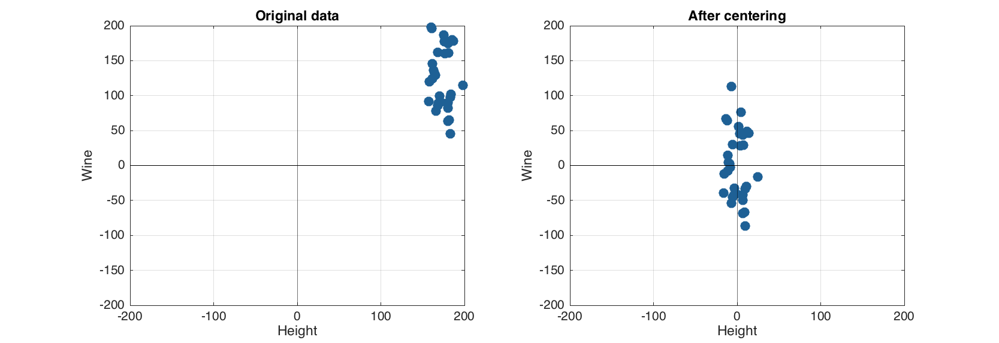
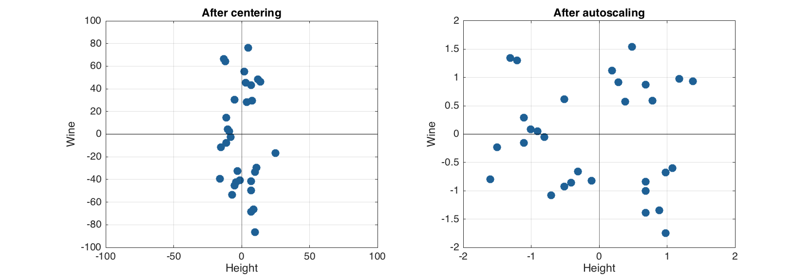
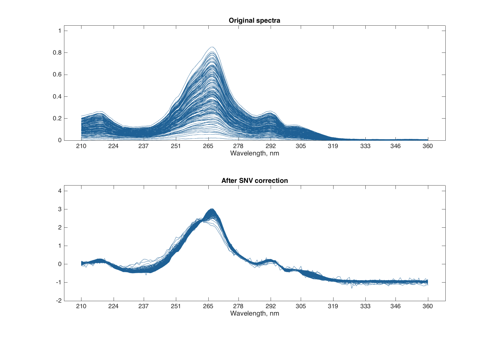
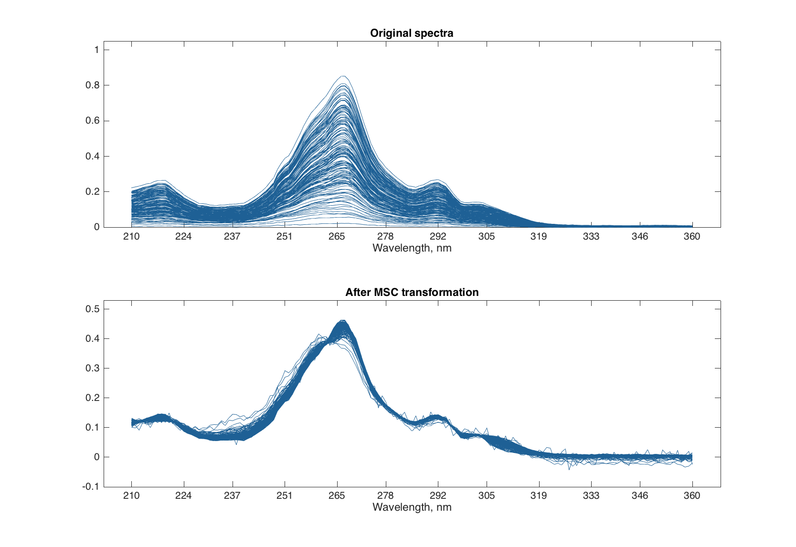
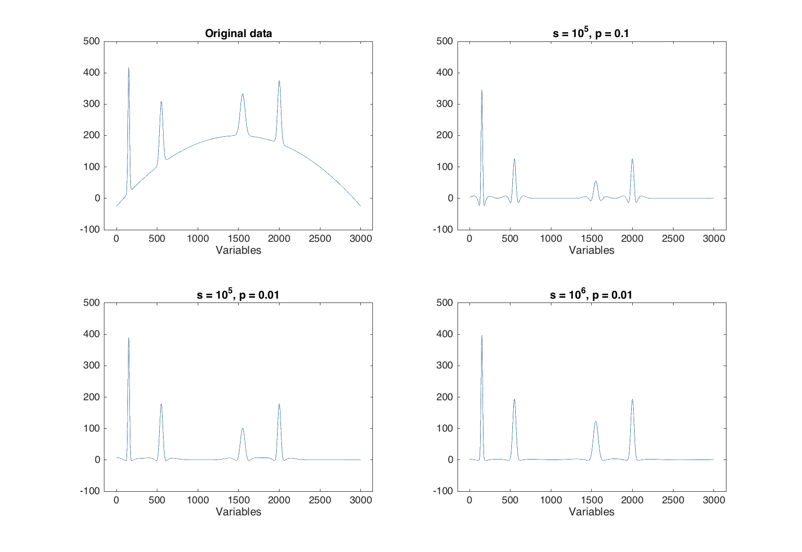

# Data preprocessing

The toolbox has a special object, which can be used to build a sequence of preprocessing methods and then use it either for preprocessing of original data or provide it as a preprocessing module to a model. In the latter case, every time the model is applied to a new data the data will be preprocessed first. In this chapter a brief description of the methods with several examples will be shown.

The general syntax is following. First one creates and empty preprocessing object. Then add or remove methods by using methods `obj.add('name', param1, param2, ...)` and `obj.remove(n)`. Below shown a table with all currently available methods and their parameters.


Let us show how all these work using two simple preprocessing methods — centering and standardization.

## Autoscaling

Autoscaling consists of two steps. First step is *centering* (or, more precise, *mean centering*) when center of a data cloud in variable space is moved to an origin. Mathematically it is done by subtracting mean from the data values separately for every variable. Second step is *standardization* (or *scaling*) when data values are divided to standard deviation so the variables have unit variance. 

Here are some examples how apply these two operations in *mdatools* (in all plots axes have the same limits to show the effect of preprocessing). We start with creating object with centering.

```matlab
load(people)

% we will use variables Wine and Height
data = people(:, {'Wine', 'Height'});

% create a preprocessing object only for centering
p = prep();
p.add('center');

% show information about the object
show(p);
```
```
Preprocessing ("prep") object
methods included: 1
1. center (mean centering)

Use "obj.add(name, properties)" to add a new method.
Use "obj.remove(n)" to remove a method from the list.

See "help prep" for list of available methods.
```
Method `show()`displays the list of added preprocessing methods, their order as well as some help information. Now we can apply the preprocessing methods of the created object to the data. In order to compare the original and preprocessed data we create a copy for the dataset and use the same scale (–200, 200) for axes on both plots.

```matlab
% create a copy of dataset and apply preprocessing
pdata1 = copy(data);
p.apply(pdata1);


% show the results
lim = 200;
figure

subplot 121
scatter(data)
title('Original data')
grid on
axis([-lim lim -lim lim])

subplot 122
scatter(pdata1)
title('After centering')
grid on
axis([-lim lim -lim lim])

```



Now let us create a reprocessing object for autoscaling by adding both centering and scaling (standardization) to the object.

```matlab
p = prep();
p.add('center');
p.add('scale');

show(p);
```
```
Preprocessing ("prep") object
methods included: 2
1. center (mean centering)
2. scale (standardization)

Use "obj.add(name, properties)" to add a new method.
Use "obj.remove(n)" to remove a method from the list.

See "help prep" for list of available methods.
```

And apply the methods to the original data.

```matlab
pdata2 = copy(data);
p.apply(pdata2);

figure 

subplot 121
scatter(pdata1)
title('After centering')
grid on
axis([-100 100 -100 100])

subplot 122
scatter(pdata2)
title('After autoscaling')
grid on
axis([-2 2 -2 2])

```




One can also use arbitrary values to center or/and scale the data, in this case use sequence or vector with these values should be provided as an argument for center or scale. Here is an example for median centering:

```matlab
p = prep();
p.add('center', median(data));
```

Any method can be removed from the sequence by using its number.

```matlab
p = prep();
p.add('center');
p.add('scale');

show(p);
```
```
Preprocessing ("prep") object
methods included: 2
1. center (mean centering)
2. scale (standardization)

Use "obj.add(name, properties)" to add a new method.
Use "obj.remove(n)" to remove a method from the list.

See "help prep" for list of available methods.
```

```matlab
p.remove(1);

show(p);
```
```
Preprocessing ("prep") object
methods included: 1
1. scale (standardization)

Use "obj.add(name, properties)" to add a new method.
Use "obj.remove(n)" to remove a method from the list.

See "help prep" for list of available methods.
```

## Correction of spectral baseline

Baseline correction methods so far include Standard Normal Variate (SNV), Multiplicative Scatter Correction (MSC) and baseline correction with Alternating Least Squares.

SNV is a very simple procedure aiming first of all to remove additive and multiplicative scatter effects from Vis/NIR spectra. It is applied to every individual spectrum by subtracting its average and dividing its standard deviation from all spectral values. Here is an example:

```matlab
% load UV/Vis spectra from Simdata
load('simdata')

% create a preprocessing object
p = prep();
p.add('snv')

% create a copy of spectra and apply preprocessing
pspectra = copy(spectra);
p.apply(pspectra)

% show the results
figure

subplot 211
plot(spectra)
title('Original spectra')

subplot 212
plot(pspectra)
title('After SNV correction')
```



Multiplicative Scatter Correction does the same as SNV but in a different way. First it calculates a mean spectrum for the whole set (mean spectrum can be also provided as an extra argument). Then, for each individual spectrum, it makes a line fit for the spectral values and the mean spectrum. The coefficients of the line, intercept and slope, are used to correct the additive and multiplicative effects correspondingly.


```matlab
% create a preprocessing object 
p = prep();
p.add('msc');

% create a copy of spectra and apply preprocessing
pspectra = copy(spectra);
p.apply(pspectra);

% show the result
figure

subplot 211
plot(spectra)
title('Original spectra')

subplot 212
plot(pspectra)
title('After MSC transformation')
```



The ALS baseline correction is very useful for removing baseline issues in spectroscopic data with relatively narrow peaks, such as Raman, IR and similar. The method has two parameters — *smoothness* (*s*, default 100000) and *penalty* (*p*, default 0.1). In the code below we generate a signal with four narrow peaks and baseline shape as a quadratic polynomial and use the preprocessing to "correct" the baseline. 

```matlab

% function for normal distribution PDF 
npdf = @(x, m, s)(1/sqrt(2 * pi * s^2) * exp(-(x - m).^2/(2 * s^2)));

% generate signal
x = 1:3000;
y = -((x - 1500) / 100).^2 + 200;
y = y + npdf(x, 150, 10) * 10000;
y = y + npdf(x, 550, 20) * 10000;
y = y + npdf(x, 1550, 30) * 10000;
y = y + npdf(x, 2000, 20) * 10000;
y = mdadata(y);

% create three preprocessing objects
p1 = prep(); p1.add('alsbasecorr', 100000, 0.1);
p2 = prep(); p2.add('alsbasecorr', 100000, 0.01);
p3 = prep(); p3.add('alsbasecorr', 1000000, 0.01);

% apply preprocessing to copies of the signal
py1 = copy(y);
p1.apply(py1);
py2 = copy(y);
p2.apply(py2);
py3 = copy(y);
p3.apply(py3);

% show results
figure

subplot 221
plot(y)
ylim([-100 500])
title('Original data')

subplot 222
plot(py1)
ylim([-100 500])

subplot 223
plot(py2)
ylim([-100 500])

subplot 224
plot(py3)
ylim([-100 500])
```



## Normalization of spectra

## Smoothing and derivatives

Savitzky-Golay filter is used to smooth signals and calculate derivatives. The filter has three arguments: a width of the filter (width), a polynomial order (porder) and the derivative order (dorder). If the derivative order is zero (default value) then only smoothing will be performed.

```matlab
% add random noise to the spectra
nspectra = ospectra + 0.025 * matrix(rnorm(length(ospectra)), dim(ospectra))

% apply SG filter for smoothing
pspectra = prep.savgol(nspectra, width = 15, porder = 1)

% apply SG filter for smoothing and take a first derivative
dpspectra = prep.savgol(nspectra, width = 15, porder = 1, dorder = 1)

% show results
par(mfrow = c(2, 2))
matplot(t(ospectra), type = 'l', col = 'blue', lty = 1, main = 'Original')
matplot(t(nspectra), type = 'l', col = 'blue', lty = 1, main = 'Noise added')
matplot(t(pspectra), type = 'l', col = 'blue', lty = 1, main = 'SG smoothing')
matplot(t(dpspectra), type = 'l', col = 'blue', lty = 1, main = '1st derivative')
Original and noisy spectra (top) and results of SG preprocessing (bottom).
```