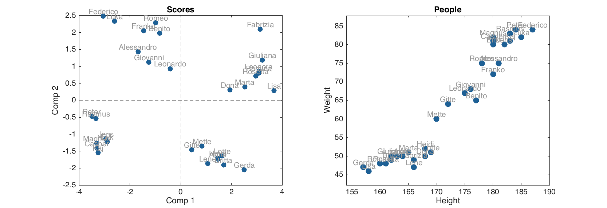

# Principal Component Analysis

In this chapter we will show how to use PCA method implemented in the *mdatools*. Besides that, we will use PCA examples to introduce some principles, which are common for most of the other methods (e.g. PLS, SIMCA, PLS-DA, etc.) available in this toolbox. This includes such things as model and result objects, showing performance statistics for models and results, validation, different kinds of plots, and so on.

Principal component analysis is one of the methods that decompose a data matrix **X** into a combination of three matrices: **X** = **TP'** + **E**. Here **P** is a matrix with unit vectors, defined in the original variables space. The unit vectors form a new basis, which is used to project all data points into. Matrix **T** contains coordinates of the projections in the new basis and product of the two matrices, **TP'** represent the coordinates of projections in original variable space. Matrix **E** contains residuals — difference between position of projected data points and their original locations.

In terms of PCA, the unit-vectors defining the new coordinate space are called *loadings* and the coordinate axes oriented alongside the loadings are *Principal Components* (PC). The coordinates of data points projected to the principal components are called *scores*. 

There are several other methods, such as *Projection Pursuit* (PP), *Independent Component Analysis* (ICA) and some others,  that work in a similar way and resulting in the data decomposition shown above. The principal difference among the methods is the way they find the orientation of the unit-vectors. Thus, PCA finds them as directions of maximum variance of data points. In addition to that, all PCA loadings are orthogonal to each other. The PP and ICA use other criteria for the orientation of the vectors for basis and e.g. for ICA the vectors are not orthogonal.

It was decided to put several methods, including ICA (and in future PP) under the PCA umbrella. First of all it was done to reduce amount of code, as the interpretation and analysis of the results, the methods return, is very similar. In order to select which method (algorithm) to use for the decomposition there is a parameter `Method` which can be defined by a user as it will be shown in the examples below.


## Model and result objects

In *mdatools*, any method for data analysis, such as PCA, PLS regression, SIMCA classification and so on, can create two types of objects — a *model* and a *result*. Every time you build a model you get a *model* object. Every time you apply the model to a dataset you get a *result* object. Thus for PCA, the objects have classes `mdapca` and `pcares` correspondingly.

Each *object* includes properties (e.g. loadings for model, scores and explained variance for result) and provides a number of methods for using the object and exploring its properties).

To calibrate a PCA model the following code should be used:

```matlab
m = mdapca(data, nComp, 'Param1', value1, 'Param2', value2, ...);
```

The first parameter `data` is mandatory, the others are optional and have default values. The full list of parameters and their description is given below: 

|Parameter|Description|
|---------|-----------|
|`data`|A dataset (object of `mdadata`class).|
|`nComp`|Number of components (if nor provided, will be calculated automatically).|
|`'Center'`|Center or not the data values (`'on'`/`'off'`, by default is on).|
|`'Scale'`|Standardize or not the data values (`'on'`/`'off'`, by default is off).|
|`'Prep'`|A preprocessing object, if provided will be used to transform the data values before creating the model or before applying the model to a new dataset.|
|`'Alpha'`|A significance level used for calculation of statistical limits for residuals plot.|
|`'CV'`|A cross-validation object (will be explained later in this chapter).|
|`'TestSet'`|A dataset (object of `mdadata` class) for test set validation.|
|`'Method'`|Which method to use for finding new basis (components). The currently avaliable values are `'svd'` (for singular value decomposition, it is a default method), `'nipals'` (for non-linear iterative partial least squares) and `'ica'` for independent component analysis. The first two methods give a solution for PCA|

Let us see how this works using a simple example — Principal Component Analysis of *People* data. We will first load the dataset and split it into two subsets as following:

```matlab
load('people');

testRows = 1:4:32;

dcal = copy(people);
dcal.removecols(testRows);
dtest = people(testRows, :);
```
So `dcal` is our calibration subset (24 rows), which we are going to use for creating a PCA model and `dtest` is a subset (8 rows) we will apply the created model to. Now let us build the model and show an information about the model object:

```matlab
m = mdapca(dcal, 7, 'Scale', 'on')

disp(m)
```
```
  mdapca with properties:

           info: []
          nComp: 7
       loadings: [12x7 mdadata]
    eigenvalues: [7x1 mdadata]
           prep: [1x1 prep]
          alpha: 0.0500
             cv: []
         calres: [1x1 pcares]
          cvres: []
        testres: []
         limits: [2x7 mdadata]
         method: 'svd'
```

As one can see, the variable `m` is an object of `mdapca` class with many properties. Some of the properties, including `nComp`, `alpha`, `info` and `method` contain the values provided by a user or the default values. The other parameters are listed in the table below:

|Property|Description|
|----|------------------------------------|
|`loadings`|A dataset with calculated loadings.|
|`eigenvalues`|A dataset with eigenvalues for each component (if available).|
|`prep`|A preprocessing object.|
|`cv`|A cross-validation object provided by user.|
|`limits`|A dataset with calculated limits for Q and T2 residuals.|
|`calres`|An object with PCA results for calibration data.|
|`cvres`|An object with PCA results for cross-validation (if used).|
|`testres`|An object with PCA results for test set (if provided).|

As you can see there are no scores, explained variance values, residuals and so on. Because they actually are not parts of the PCA model, they are results of applying the model to a calibration set. But loadings, eigenvalues, number of calculated components, methods used for data preprocessing, parameters of cross-validation and statistical limits for the residuals are properties of the model. Here is an example on how to look at the loading values (first five rows):

```matlab
show(m.loadings(1:5, :))
```
```
Loadings:

                         Components
           Comp 1  Comp 2   Comp 3   Comp 4  Comp 5
         -------- ------- -------- -------- -------
  Height   -0.377  -0.179   0.0442  -0.0309   0.135
  Weight   -0.387  -0.106   0.0239   0.0524   0.204
Hairleng     0.34   0.118  -0.0643  -0.0208   0.851
Shoesize   -0.378  -0.172  -0.0358   -0.024   0.187
     Age  -0.0836  0.0693   -0.695    0.198   0.032
```

One can also notice that the model object has one particular property, `calres`,  which is in fact an object with PCA results obtained when the model was applied to the calibration set. If we look at the object description we will get the following:

```matlab
disp(m.calres)
```
```
  pcares with properties:

        info: 'Results for calibration set'
      scores: [24x5 mdadata]
    variance: [5x2 mdadata]
    modpower: [24x5 mdadata]
          T2: [24x5 mdadata]
           Q: [24x5 mdadata]
```

The properties of the objects are datasets with scores, explained variance (individual and cumulative), modeling power, T2 and Q residuals. Here are the values for variance:

```matlab
show(m.calres.variance)
```
```
Variance:

            Variance
        Expvar  Cumexpvar
       ------- ----------
Comp 1    52.1       52.1
Comp 2    19.2       71.3
Comp 3    15.3       86.6
Comp 4    7.69       94.3
Comp 5    2.57       96.9
```

Both model and result objects also have a certain amount of methods, first of all for visualizing various values (e.g. scores plot, loadings plot, etc.). 

## Applying a model to a new dataset

The result object is also created every time you apply a model to a new data. To do this one shall use a method `predict()`. The first argument of the method is always an object with a model, or, alternatively one can call the method using the model object, e.g. `obj.predict()`. The next argument is dataset with new values. Here is a PCA example (assuming we have already built the model above):

```matlab
res = m.predict(dtest);
disp(res)
```
```
  pcares with properties:

        info: []
      scores: [8x5 mdadata]
    variance: [5x2 mdadata]
    modpower: [8x5 mdadata]
          T2: [8x5 mdadata]
          Q2: [8x5 mdadata]
```

The parameter `info` both for model and for result objects can be changed manually after the object is created:

```matlab
res.info = 'New predictions';
disp(res)
```
```
  pcares with properties:

        info: 'New predictions'
      scores: [8x5 mdadata]
    variance: [5x2 mdadata]
    modpower: [8x5 mdadata]
          T2: [8x5 mdadata]
          Q2: [8x5 mdadata]
```          

## Validation

Any model can be validated in two ways — validation with a test set or/and cross-validation. To validate model with a test set one just need to provide the set using proper parameter.

```matlab
mt = mdapca(dcal, 5, 'Scale', 'on', 'TestSet', dtest);
disp(mr)
```
```
  mdapca with properties:

           info: []
          nComp: 5
       loadings: [12x5 mdadata]
    eigenvalues: [5x1 mdadata]
           prep: [1x1 prep]
          alpha: 0.0500
             cv: []
         calres: [1x1 pcares]
          cvres: []
        testres: [1x1 pcares]
         limits: [2x5 mdadata]
         method: 'svd'
```

As one can see now both `calres` and `testres` properties are `pcares` objects, while the `cvres` remains empty. 

To perform cross-validation user needs to specify a cell array with cross-validation settings. The cell array has a following structure: `{'name', nseg, niter}`. Here `name` is a type of cross-validation, which can be `'full'` for full cross-validation, aka "leave-one-out"), `'rand'` is random segmented cross-validation and `'ven'` for systematic cros-validation using "venetian blinds" method. For the last two methods one has also to specify a number of segments, `nseg`. 

For random cross-validation it is also possible to define a number of iterations (repetitions), `niter`. In this case the cross-validation will be performed `niter` times and the results will be averaged. Here is an example for random cross-validation with 10 splits.


```matlab
mcv = mdapca(dcal, 7, 'Scale', 'on', 'CV', {'rand', 10});
disp(mcv)
```
```
  mdapca with properties:

           info: []
          nComp: 7
       loadings: [12x7 mdadata]
    eigenvalues: [7x1 mdadata]
           prep: [1x1 prep]
          alpha: 0.0500
             cv: {'rand'  [10]}
         calres: [1x1 pcares]
          cvres: [1x1 pcares]
        testres: []
         limits: [2x7 mdadata]
         method: 'svd'
```
```matlab
show(mcv.cvres.variance)
```
```
Variance:

            Variance
        Expvar  Cumexpvar
       ------- ----------
Comp 1    41.6       41.6
Comp 2    18.6       60.2
Comp 3    17.5       77.6
Comp 4    12.4         90
Comp 5    3.88       93.9
Comp 6   0.308       94.2
Comp 7    1.94       96.1
```

The cross-validated results have only one difference from the calibration and test set results — the object do not have scores values. 

Cross-validation and validation with a test set can be combined:

```matlab
mcvt = mdapca(dcal, 7, 'Scale', 'on', 'CV', {'rand', 10}, 'TestSet', dtest);
disp(mcvt)
```
```
  mdapca with properties:

           info: []
          nComp: 7
       loadings: [12x7 mdadata]
    eigenvalues: [7x1 mdadata]
           prep: [1x1 prep]
          alpha: 0.0500
             cv: {'rand'  [10]}
         calres: [1x1 pcares]
          cvres: [1x1 pcares]
        testres: [1x1 pcares]
         limits: [2x7 mdadata]
         method: 'svd'
```

Now the model object has all three results as `pcares` objects.

## Exploring the results

Any result object in `mdatools` has at least two methods for exploring the results. First is `summary()`, which shows statistics about how model performs on a particular data set, and the second is `plot()` which shows a set of plots for a quick overview of the results.

```matlab
summary(m.calres)
```
```
Results for calibration set

Variance:

            Variance
        Expvar  Cumexpvar
       ------- ----------
Comp 1    52.1       52.1
Comp 2    19.2       71.3
Comp 3    15.3       86.6
Comp 4    7.69       94.3
Comp 5    2.57       96.9
```

```matlab
figure
plot(m.calres)
```


The output for summary as well as the plots in the set depends on a method. For PCA the set includes scores plot, residuals plot, and plots with individual and cumulative explained variances. 

User can change number of components for the scores and loadings plots as well as turn off the labels on the plots.

```matlab
figure
plot(m.calres, [1 3], 'Labels', 'off')
```


Now let us look at the plots closer. The list of the plots and corresponding methods for PCA result object is shown below.

|Method|Plot|
|------|----|
|`plotscores(m, comp, ...)`|Scores plot|
|`plotresiduals(m, ncomp, ...)`|Residuals plot (Q vs T2)|
|`plotexpvar(m, ...)`|Explained variance plot (individual)|
|`plotcumexpvar(m, ...)`|Cumulative explained variance plot|


Most of the plots can be shown using different ways, e.g. as a scatter, a line, or a bar plot. To switch between them there is a parameter `'Type'`, which can in general have the following values: `'scatter'`, `'densscatter'`, `'line'`, `'bar'`. Here is an example for the scores plot:

```matlab
figure
subplot 211
plotscores(m.calres, 1:3, 'Type', 'line')
subplot 212
plotscores(m.calres, 2, 'Type', 'bar')
```


In this case, second argument for the plotting method should always be the componets to show the scores for. One can also change corresponding plot parameters easily.

```matlab
figure
subplot 221
plotscores(m.calres, [1 2], 'Labels', 'names', 'Marker', 's', 'Color', 'r')
subplot 222
plotresiduals(m.calres, 2, 'Marker', '^', 'MarkerSize', 10)
subplot 223
plotexpvar(m.calres, 'Type', 'bar', 'FaceColor', 'g')
subplot 224
plotcumexpvar(m.calres, 'Type', 'line', 'Marker', 'o', 'MarkerSize', 10)
```


## Exploring the models 

The model objects have the same plots (plus loadings plot) and the `summary()` method as the result objects, however they work in a slightly different way. Thus `summary()` will show the statistics for each type of the available results (e.g. for calibration and validation).


```matlab
summary(mt)
```
```
        Eigenvalues  Expvar  Cumexpvar  Expvar (Test)  Cumexpvar (Test)
       ------------ ------- ---------- -------------- -----------------
Comp 1         6.25    52.1       52.1           60.6              60.6
Comp 2         2.31    19.2       71.3           11.2              71.8
Comp 3         1.84    15.3       86.6           10.3              82.1
Comp 4        0.922    7.69       94.3           10.4              92.5
Comp 5        0.309    2.57       96.9           2.55              95.1
```

And the plots show the items for each type of the results available in the object.

```matlab
figure
plot(mt)
```


First of all, it must be noted, that most of the plots for a model object are group plots. It is assumed that model may have more than one type of results (e.g. calibration and cross-validation). Therefore, the model plots use colors and legend to differentiate the results visually, which reduces a possibility for tuning the model plots. 

Some of the plots (the ones, which either depend on number of components or on the number of results, but not on both), though, can be shown using different ways, e.g. as a scatter, a line, or a bar plot similar to how it works for the result object. 

Let us start with the loadings plot, since it does not depends on number of results, tuning the plot as easy as any other group plot:

```matlab
figure
subplot 321
plotloadings(m)
subplot 322
plotloadings(m, [1 3], 'Color', 'r', 'Marker', 's', 'Labels', 'names')
subplot (3, 2, 3:4)
plotloadings(m, 1:2, 'Type', 'line')
subplot (3, 2, 5:6)
plotloadings(m, 1:3, 'Type', 'bar', 'FaceColor', 'rgb')
```


The explained variance plot for the model depends on the results (explained variance e.g. for calibration and cross-validation is different) but not on the components (since it shows the values for all/each components). So it can be tuned in a similar way (though it makes no sense to have it as a scatter plot).

```matlab
figure
subplot 221
plotexpvar(mt)
subplot 222
plotexpvar(mt, 'Type', 'bar', 'FaceColor', 'rg', 'Labels', 'values')
subplot 223
plotcumexpvar(mt)
subplot 224
plotcumexpvar(mt, 'Type', 'bar', 'FaceColor', 'rg', 'Labels', 'values')
```


The scores and residuals plots depends on both number of results (e.g. objects from calibration and test set have scores and residuals and must be shown on the plots using different colors) as well as on number of components (each plot shows the values for a selected components or number of components in the model). 

```matlab
figure
subplot 221
plotscores(mt)
subplot 222
plotscores(mt, [1 2], 'Marker', {'s', 'd', 'o'}, 'Color', 'rgb')
subplot 223
plotresiduals(mt)
subplot 224
plotresiduals(mt, 2, 'Marker', {'s', 'd', 'o'}, 'Color', 'rgb')
```


If you want to change any parameter for these two plots, you need to specify the second argument first, which is XY components (2 values) for scores and number of components (one value) for residuals.

If you want to change marker symbol, color and similar parameters for scores and residuals plots, it is necessary to provide three values for each (for calibration, cross-validation and test results), like shown in the examples above. Even if one of the results is missing or, as e.g. scores for cross-validation, is not shown. This allows to avoid any confusion when compare results for a PCA model. 

## Making preprocessing part of a model

Data preprocessing  is a very important step for, among other reasons, getting better (more efficient, more intepretable, etc.) model. On a calibration step it is necessary to play with preprocessing methods, see how they change original data structure etc. However, when we create a final model, it is always a good idea to make the selected preprocessed steps a part of the model. In this case, when model is applied to a new data, the preprocessing steps will be carried out automatically, so model can be applied to a raw data.  

Any model in *mdatools* has a parameter where preprocessing object can be kept. In this parameter is not empty even if no preprocessing object is provided by a user. Since in most of the models data is centered (and sometimes standardized) this operations are kept in this object. To provide the other preprocessing methods one has to simply specify an `Prep` parameter when creates a model. In the example below we use PCA for *People* data and instead of setting parameter `'Scale'` to `'on'` we create a preprocessing object with standardization and provide it to the model.

```matlab

load('People');

p = prep();
p.add('scale');

m = mdapca(people, 5, 'Prep', p);

figure
plot(m)
```


As one can see the result is the same. Now we can make prediction for a new object providing a raw data.

```matlab
v = [180 85 -1 44 26000 300 120 -1 95 -1 120];
p = mdadata(v, {'New person'}, people.colNames);

show(p)
```
```
                                                   Variables
            Height  Weight  Hairleng  Shoesize      Age  Income  Beer  Wine  Sex  Swim  Region   IQ
           ------- ------- --------- --------- -------- ------- ----- ----- ---- ----- ------- ----
New person     180      85        -1        44  2.6e+04     300   120    -1   95    -1      -1  120
```

```matlab
% apply PCA model to the new object
res = m.predict(p);

% show scores and residuals for calibration set and for the new result together
figure

subplot 121
plotscores(m.calres)
hold on
plotscores(res, 'Color', 'r', 'Labels', 'names')
hold off

subplot 122
plotresiduals(m.calres)
hold on
plotresiduals(res, 'Color', 'r', 'Labels', 'names')
hold off
```



The new person is fitted by the model very well.


