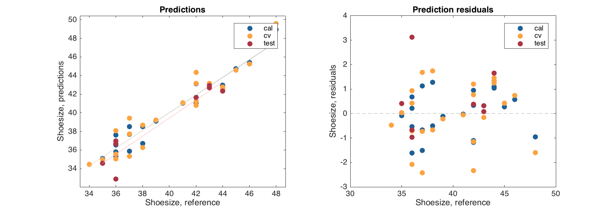
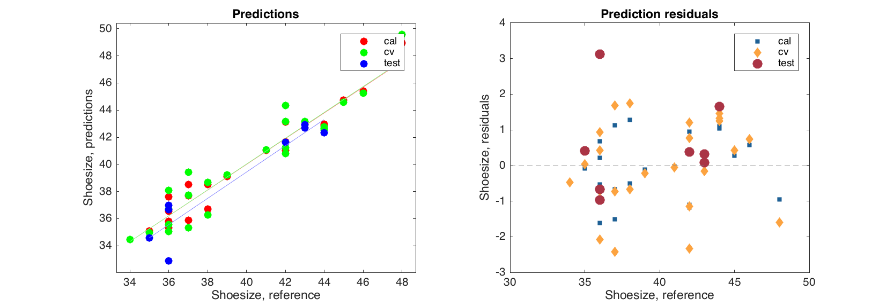

# Multiple linear regression

Multiple linear regression (MLR) is a simplest method, which can be used for relating a multivariate dataset **X** with a vector of response values **y** as a linear combination: $$y_i = b_0 + b_1x_{i1} + b_2x_{i2} + ... + b_nx_{in}$$. In its simplest form (meaning without constraints, penalties, etc.) the solution can be found by using one line of MATLAB code (we assume that matrix X already has a column of ones here).

```matlab
b = X \ y;
```
However, besides just obtaining the vector with regression coefficients, one can do a lot of other things, including computing of performance statistics (prediction quality), model validation (cross-validation and test set validation), calculation of confidence intervals for the regression coefficients and, of course, graphical representation of all calculations. Moreover, other regression methods, such as Projection on Latent Structures (PLS) can be represented using MLR results as a basis. Therefore it was decided to include this method to the toolbox and in this chapter we will show how to work with the regression results and model. All methods and plots we are going to consider here are also available for other methods, e.g. PLS.

## Calibrating an MLR model

The idea is absolutely the same as with PCA — a method creates two kinds of objects, a *model* object, which contains all model properties, and one or several *result* objects with results of applying the model to a particular dataset. To calibrate a model one has to provide just two datasets — with **X** and **y** values as well as several optional parameters. The syntax and short description of the parameters are shown below.

```matlab
m = mdamlr(X, y, 'Param1', value1, 'Param2', value2, ...);
```

|Parameter|Description|
|---------|-----------|
|`X`|A dataset (object of `mdadata`class) with predictors.|
|`y`|A dataset (object of `mdadata`class) with responses.|
|`'Center'`|Center or not the data values (`'on'`/`'off'`, by default is on).|
|`'Scale'`|Standardize or not the data values (`'on'`/`'off'`, by default is off).|
|`'Prep'`|A cell array with two preprocessing objects (first for X and second for y).|
|`'Alpha'`|A significance level used for calculation of confidence intervals for regression coefficients.|
|`'CV'`|A cell array with cross-validation parameters.|
|`'TestSet'`|A cell array with two dataset (X and y, both objects of `mdadata` class) for test set validation.|

We will use a reduced *People* data for all examples in this chapter trying to predict *Shoesize* using *Height*, *Income*, *Age*, *Beer* and *IQ* values. We will also split the values into a calibration and a test set.

```matlab
load('people');

% split data into subsets
tind = 4:4:32;

Xc = people(:, {'Height', 'Income', 'Age', 'Beer', 'IQ'});
Xc.removerows(tind);
yc = people(:, 'Shoesize');
yc.removerows(tind);

Xt = people(tind, {'Height', 'Income', 'Age', 'Beer', 'IQ'});
yt = people(tind, 'Shoesize');

% create a model and show the object info
m = mdamlr(Xc, yc);
disp(m)
```
```
  mdamlr with properties:

         info: []
         prep: {[1x1 prep]  [1x1 prep]}
           cv: []
    regcoeffs: [1x1 regcoeffs]
       calres: [1x1 mlrres]
        cvres: []
      testres: []
        alpha: 0.0500
        nComp: 1
```

The main properties of the model object are the following. First of all, one can notice three properties related to results, similar to what was in PCA model, — `calres`, `cvres`, and `testres`. Because we did not use any validation in this case, the last two properties are empty and `calres` is an object of `mlrres` (MLR results) class.

Parameters `info` and `cv` have the same meaning as for PCA. Parameter `nComp` is number of components in a model, and since MLR does not use any components it is always set to one. The parameter is needed for compatibility with other regression methods. Parameter `alpha` for MLR and other regression models is a significance level used for calculation of confidence intervals for regression coefficients (will be discussed later in this chapter).

Another similar parameter, `prep`, now looks a cell array with two values — preprocessing objects. The first is used for preprocessing of predictors (**X**) and the second for response (**y**) values. By default model centers both data sets. Similar to PCA, one can also scale the values using parameter `'Scale'` and/or define a manual set of preprocessing methods and provide it to the model using parameter `'Prep'`. In this case it is necessary to provide two preprocessing objects combaining them using a cell array. In the example below we will create the objects with standardization and provide them to the MLR model instead of just setting `'Scale'` to `'on'`. 

```matlab
px = prep();
px.add('scale');

py = prep();
py.add('scale');

m = mdamlr(Xc, yc, 'Prep', {px, py});
```

If there is no need to preprocess e.g. **y** values, then an empty preprocessing object should be provided. It can be created using method `prep()` as above, just do not add any preprocessing methods to it.

## Exploring MLR results

Let us look at the calibration results for the model we created in the last code section.

```matlab
disp(m.calres)
```
```
  24x1 mlrres array with properties:

    info: 'Results for calibration set'
    yref: [24x1 mdadata]
    stat: [1x1 struct]
```

The result object has three properties: `info`, which is just a text with information about the object, `yref` - a dataset with reference (provided by a user) response values and `stat` - a structure with performance statistics. Actually there is one more, hidden property, `ypred`, with a dataset where predicted response values are stored.

```matlab
disp(m.calres.ypred)
```
```
  24x1 mdadata array with properties:

            name: 'Predicted values'
            info: []
        dimNames: {'Objects'  'Responses'}
          values: [24x1 double]
           nCols: 1
           nRows: 24
        nFactors: 0
        rowNames: {24x1 cell}
        colNames: {'Shoesize'}
    rowFullNames: {24x1 cell}
    colFullNames: {'Shoesize'}
```

So we can look at the reference and predicted values:

```matlab
show([m.calres.yref m.calres.ypred])
```
```
               Variables
          Shoesize  VShoesize
         --------- ----------
    Lars        48         49
   Peter        44         43
  Rasmus        44       42.9
   Mette        38       38.5
   Gitte        39       39.1
    Jens        42       43.2
   Lotte        36       37.6
   Heidi        37       37.7
     Kaj        42       43.1
    Anne        38       36.7
  Britta        37       35.9
  Magnus        44       42.7
    Luka        45       44.7
Federico        46       45.4
    Dona        37       38.5
    Lisa        34       34.5
  Benito        41         41
  Franko        43       43.2
 Leonora        36       35.8
Giuliana        36       35.3
Giovanni        42       41.7
   Marta        36       36.5
 Rosetta        35       35.1
   Romeo        42         41
```

Because column name in both datasets is `'Shoesize'` a letter `'V'` was added to the second column when datasets were binded.

The parameter `stat` combines datasets with performance statistics based on the predicted and reference values, which include the coefficient of determination (R<sup>2</sup>), the root mean squared error (RMSE), bias, slope, as well as the ratio of standard error of prediciton to sample standard deviation (RPD).

```matlab
disp(m.calres.stat)
```
```
     rmse: [1x1 mdadata]
     bias: [1x1 mdadata]
    slope: [1x1 mdadata]
       r2: [1x1 mdadata]
      rpd: [1x1 mdadata]
```

The MLR results also have a couple of methods for quick overview of the predictions results. First of all it is already known `summary()`, which, in this case, shows the mentioned above statistics for predictions.

```matlab
summary(m.calres)
```
```
Results for calibration set

Prediction performance for Shoesize:
   RMSE      Bias  Slope     R2  RPD
 ------ --------- ------ ------ ----
  0.899  3.26e-15  0.948  0.948  4.4
```

As well as two plots. One with predicted and reference response values and one with residuals (difference between predicted and reference values) against the reference values.

```matlab
figure
subplot 121
plotpredictions(m.calres)
subplot 122
plotyresiduals(m.calres)
```


The plots can be tuned as any conventional plot for the `mdadata` object.

```matlab
figure
subplot 121
plotpredictions(m.calres, 'Marker', 's', 'Colorby', m.calres.yref)
subplot 122
plotyresiduals(m.calres, 'Color', 'c', 'Labels', 'names')
```


## Validation

Any MLR (as well as any other regression model) can be validated using cross-validation or validation with a test set. The procedure is very similar to what we did with PCA. For cross-validation one has to specify a cell array with main parameters. In this case we will use random cross-validation with 8 segments and 4 repetitions. Also, to make the code shorter, we will use parameter `'Scale'` for scaling instead of providing preprocessing objects as we did before.

```matlab
mcv = mdamlr(Xc, yc, 'Scale', 'on', 'CV', {'rand', 8, 4});
disp(mcv)
```
```
  mdamlr with properties:

         info: []
         prep: {[1x1 prep]  [1x1 prep]}
           cv: {'rand'  [8]  [4]}
    regcoeffs: [1x1 regcoeffs]
       calres: [1x1 mlrres]
        cvres: [1x1 mlrres]
      testres: []
        alpha: 0.0500
        nComp: 1
```

As one can notice, the parameters `cv` and `cvres` are not empty anymore. 

```matlab
summary(mcv.cvres)
```
```
Results for cross-validation

Prediction performance for Shoesize:
  RMSE    Bias  Slope     R2   RPD
 ----- ------- ------ ------ -----
  1.26  0.0599  0.945  0.901  3.14
```

For test set validation (again, similar to PCA) one has to provide values for the parameter `TestSet`. Since for regression we need two datasets, they should be combined using a cell array.

```matlab
mt = mdamlr(Xc, yc, 'Scale', 'on', 'TestSet', {Xt, yt});
```

And, of course, both validation methods can be combined.

```matlab
mcvt = mdamlr(Xc, yc, 'Scale', 'on', 'CV', {'rand', 8, 4}, 'TesetSet', {Xt, yt});
disp(mcvt)
```
```
  mdamlr with properties:

         info: []
         prep: {[1x1 prep]  [1x1 prep]}
           cv: {'rand'  [8]  [4]}
    regcoeffs: [1x1 regcoeffs]
       calres: [1x1 mlrres]
        cvres: [1x1 mlrres]
      testres: [1x1 mlrres]
        alpha: 0.0500
        nComp: 1
```

Now all types of results are available in the model.

## Exploring MLR model

The MLR model has the same `summary()` method as well as the two plots as the MLR results. However, in this case, `summary()` shows statistics for each type of the available results separately.

```matlab
summary(mcvt)
```
```
Results for calibration set

Prediction performance for Shoesize:
   RMSE       Bias  Slope     R2  RPD
 ------ ---------- ------ ------ ----
  0.899  -1.18e-15  0.948  0.948  4.4


Results for cross-validation

Prediction performance for Shoesize:
  RMSE    Bias  Slope     R2   RPD
 ----- ------- ------ ------ -----
  1.26  -0.012  0.946  0.901  3.14


Results for test set

Prediction performance for Shoesize:
  RMSE    Bias  Slope     R2   RPD
 ----- ------- ------ ------ -----
  1.43  -0.541  0.969  0.895  2.97
```

And the plots group points according to the results.

```matlab
figure
subplot 121
plotpredictions(mcvt)
subplot 122
plotyresiduals(mcvt)
```



The plots can be tuned as any other group plot for `mdadata` object.

```matlab
figure
subplot 121
plotpredictions(mcvt, 'Color', 'rgb')
subplot 122
plotyresiduals(mcvt, 'Marker', {'s', 'd', 'o'}, 'MarkerSize', [10 20 30])
```




## Regression coefficients

MLR model has one more important parameter — a regression coefficients. If one looks at the model object info, it can be noticed that this is not a dataset, but an object of `refcoeffs` class. Let us have a closer look to the object.

The object has several hidden properties (which are not shown when use `disp()` method), including `values` with actual values for the coefficients, `ci` for confidence intervals and `pvalues` a set of p-values for testing can a particular regression coefficient be equal to zero in a population. 

```matlab
show(m.regcoeffs.values)
```
```
Regression coefficients:
        Shoesize
       ---------
Height     0.909
Income    -0.346
   Age     0.344
  Beer      0.13
    IQ    -0.031
```

The last two parameters are calculated using [Jack-Knife](https://en.wikipedia.org/wiki/Jackknife_resampling) method and one sample t-test. They available only if cross-validation was used. Moreover, it is recommended to use cross-validation with relatively large number of segments (more than 6) or full cross-validation for proper calculation of these two statistics.

```matlab
disp(m.regcoeffs.pvalues)
```
```
p-values are not available.
```
```matlab
disp(mcv.regcoeffs.pvalues)
```
```
  5x1 mdadata array with properties:

            name: 'P-values for regression coefficients'
            info: []
        dimNames: {'Variables'  'Responses'}
          values: [5x1 double]
           nCols: 1
           nRows: 5
        nFactors: 0
        rowNames: {'Height'  'Income'  'Age'  'Beer'  'IQ'}
        colNames: {'Shoesize'}
    rowFullNames: {'Height'  'Income'  'Age'  'Beer'  'IQ'}
    colFullNames: {'Shoesize'}
```
```matlab
show(mcv.regcoeffs.ce)
```
```

P-values for regression coefficients:
        Shoesize
       ---------
Height  5.01e-06
Income    0.0306
   Age    0.0441
  Beer     0.181
    IQ     0.521
```

If confidence intervals and p-values are available, one can get an overview of all of them using method `summary()`.

```matlab
summary(mcv.regcoeffs)
```
```
Summary statistics for regression coefficients:
             Lo   Value       Up   p-value
       -------- ------- -------- ---------
Height    0.732   0.909     1.08  5.01e-06
Income   -0.662  -0.346  -0.0439    0.0306
   Age   0.0124   0.344    0.693    0.0441
  Beer  -0.0799    0.13     0.35     0.181
    IQ   -0.125  -0.031   0.0695     0.521
```

Any regression model has a method for showing the regression coefficients graphically, `plotregcoeffs()`. The plot can be line or bar and if confidence intervals are available they are show on the plot as errorbars (if bar plot is used) or lines (if line plot is used). In the example below we create two models with full cross-validation and use different significant levels for calculation of confidence intervals. Then show the regression coefficients plots using different plot types.


```matlab
m1 = mdamlr(Xc, yc, 'Scale', 'on', 'CV', {'full'}, 'Alpha', 0.01);
m2 = mdamlr(Xc, yc, 'Scale', 'on', 'CV', {'full'}, 'Alpha', 0.1);

figure
subplot 221
plotregcoeffs(m1)
subplot 222
plotregcoeffs(m2)
subplot 223
plotregcoeffs(m1, 'Type', 'line')
subplot 224
plotregcoeffs(m2, 'Type', 'line')
```


If type of the plot is not specified, the object select it automatically depending on number of predictors in the dataset (more than 12 — line plot, otherwise - bar plot). The confidence intervals can be hidden by setting a parameter `'CI'` to `'off'`.   

```matlab
figure
subplot 121
plotregcoeffs(m1, 'CI', 'off')
subplot 122
plotregcoeffs(m1, 'Type', 'line', 'CI', 'off')
```


By the way, one can clearly notice that the only predictor which significantly different from zero (and therefore is important for prediction of *Shoesize*) is *Height*, which is quite reasonable. The variable *Beer* which correlates both with *Height* and *Shoesize* is not important in this model as MLR performs badly with correlated predictors.

## Predictions

Finally any model can be applied to a new dataset using method *predict()*. In this case there are two possibilities. If only **X** values are provided, the model will calculate predictions but of course will not be able to compute statistics and residuals. 

```matlab
res = mcv.predict(Xt);
show(res.ypred)
```
```
Predicted values:
               1
           -----
      Lene    37
      Erik  42.7
     Gerda  32.9
    Casper  42.4
  Fabrizia  36.7
Alessandro  42.9
  Leonardo  41.6
    Romina  34.6
```

```matlab
summary(res)
```
```
```

```matlab
plot(res)
```

If both **X** and **y** values are provided then all methods described above for the MLR results will work.


