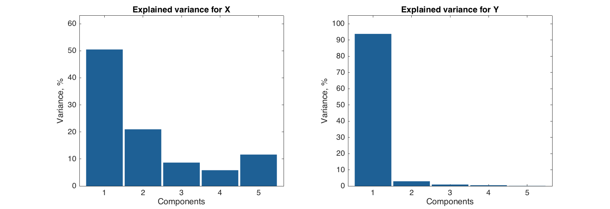
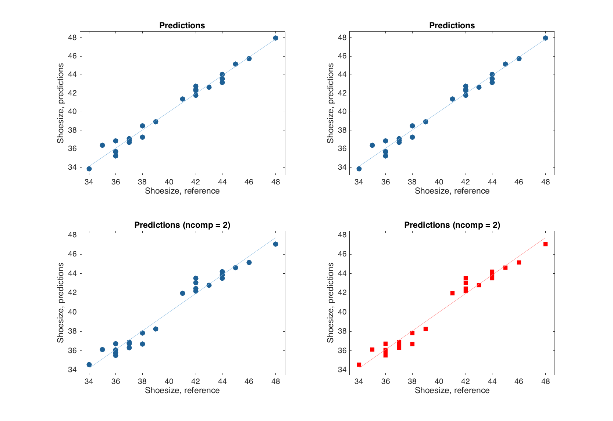
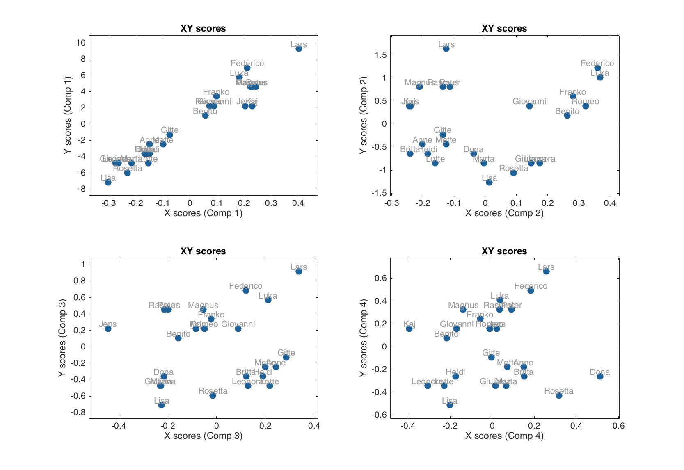
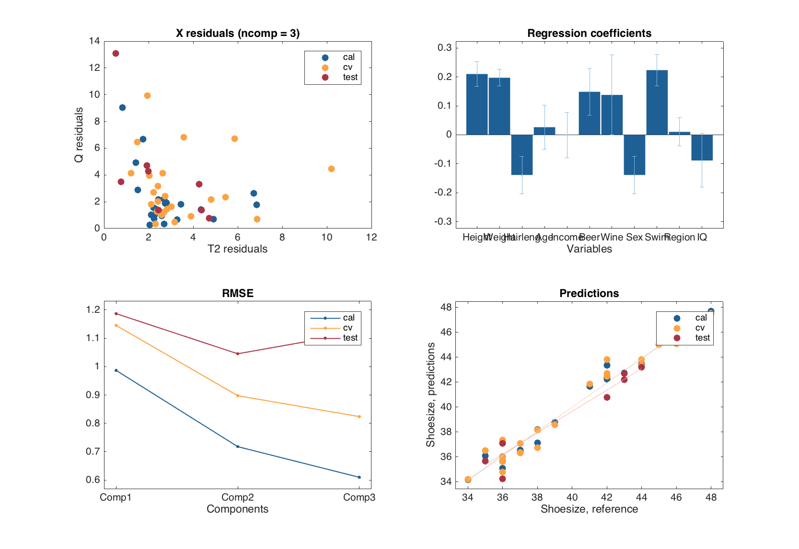
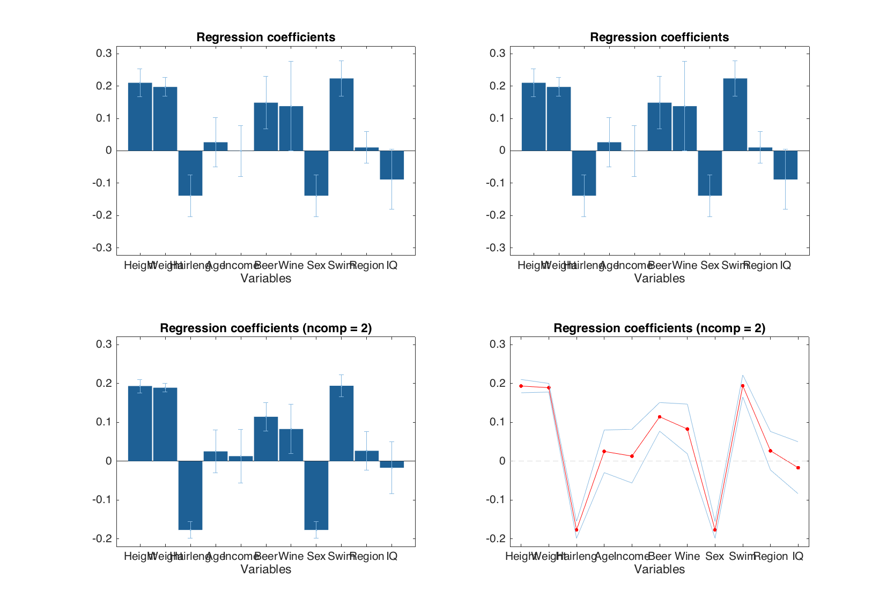
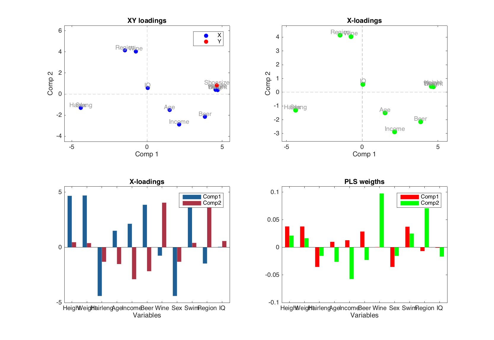

# Projection on Latent Structures

[Projection on Latent Structures](https://en.wikipedia.org/wiki/Partial_least_squares_regression) (PLS) also known as Partial Least Squares is a linear regression method introduced and developed by Herman and Svante Wold for dealing with multivariate data. The method aims, among others, at overcome the drawbacks of MLR and allows to create a linear regression model when number of objects is smaller than the number of variables and when there is a high degree of collinearity in the data.

PLS decomposes both $$X$$ and $$Y$$ space by projecting data points to a set of latent variables (PLS components or just components) similar to PCA decomposition:

$$
X = TP^T + E_X
$$
$$
Y = UQ^T + E_Y
$$

So there is a set of loadings $$(P,Q)$$, scores $$(T,U)$$ and residuals for each of the spaces. However, in this case, the PLS components are oriented to get a covariance between X-scores ($$T$$) and Y-scores ($$U$$) maximized (in contrast to PCA where the components are oriented along the direction of maximum variance of the data points). Or, in other words, PLS tries to capture the part of X-data which explains maximum of the variance in Y-data.

The final PLS regression model is actually similar to MLR model and is represented by a set of regression coefficients (and its confidence intervals if they were calculated). So all plots and methods discussed in the previous section for MLR method will work similarly with PLS. But PLS has a lot of additional properties and tools for exploring the both datasets and for optimizing the prediction performance. Implementation of these tools we are going to discuss in this section.

## Calibration of a PLS model

The general syntax for calibration is very similar to the MLR, however, in this case, user can provide one more parameter — number of components to be used for the decomposition of $$X$$ and $$Y$$ spaces. The general syntax and short description of main parameters are shown below.

```matlab
m = mdapls(X, Y, nComp, 'Param1', value1, 'Param2', value2, ...);
```

|Parameter|Description|
|---------|-----------|
|`X`|A dataset (object of `mdadata`class) with predictors.|
|`Y`|A dataset (object of `mdadata`class) with responses.|
|`nComp`|A number of PLS components to be used in the model.|
|`'Center'`|Center or not the data values (`'on'`/`'off'`, by default is on).|
|`'Scale'`|Standardize or not the data values (`'on'`/`'off'`, by default is off).|
|`'Prep'`|A cell array with two preprocessing objects (first for X and second for Y).|
|`'Alpha'`|A significance level used for calculation of confidence intervals for regression coefficients.|
|`'CV'`|A cell array with cross-validation parameters.|
|`'TestSet'`|A cell array with two dataset (X and Y, both objects of `mdadata` class) for test set validation.|
|`'Method'`|PLS algorithm, so far only `'simpls'` is available.| 

We will use similar example as for MLR chapter but in this case we will use all variables from the *People* data trying to predict *Shoesize*. 

```matlab
load('people');

% split data into subsets
tind = 4:4:32;

Xc = copy(people);
Xc.removecols('Shoesize')
Xc.removerows(tind);

yc = people(:, 'Shoesize');
yc.removerows(tind);

Xt = people(tind, :);
Xt.removecols('Shoesize')
yt = people(tind, 'Shoesize');

% create a model object and show the object info
m = mdapls(Xc, yc, 5, 'Scale', 'on');
disp(m)
```
```
  mdapls with properties:

    xloadings: [12x5 mdadata]
    yloadings: [1x5 mdadata]
      weights: [12x5 mdadata]
    vipscores: [12x1 mdadata]
     selratio: [12x1 mdadata]
         info: []
         prep: {[1x1 prep]  [1x1 prep]}
           cv: []
    regcoeffs: [1x1 regcoeffs]
       calres: [1x1 plsres]
        cvres: []
      testres: []
        alpha: 0.0500
        nComp: 5
```

We will skip the explanation of the model parameters that are similar to MLR. In addition to them, there are also loadings for X-space (`xloadings`), loadings for Y-space (`yloadings`), weights (in some literature they are called as “loading-weights”, `weights`), VIP scores (`vipscores`) and selectivity ratio (`selratio`). The last two parameters are statistics, which can be used to indentify variables, most important for prediction, and will be discussed in a separate chapter. 


Validation of a PLS-model as well as providing preprocessing objects for predictors and responses can be carried out similar to MLR.

## Exploring PLS results

Let us first look at the structure of PLS results.

```matlab
disp(m.calres)
```
```
  24x5 plsres array with properties:

    xdecomp: [1x1 ldecomp]
    ydecomp: [1x1 ldecomp]
       info: 'Results for calibration set'
       yref: [24x1 mdadata]
       stat: [1x1 struct]
```

As one can note it looks similar to the MLR results, however there are two new properties — `xdecomp` and `ydecomp`. These are objects containing the decomposition of X- and Y-space as defined in the beginning of this chapter. The objects are identical to the objects, representing PCA-results.

```matlab
disp(m.calres.xdecomp)
```
```
  ldecomp with properties:

         info: []
       scores: [24x5 mdadata]
    residuals: [24x12 mdadata]
     variance: [5x2 mdadata]
     modpower: [24x5 mdadata]
           T2: [24x5 mdadata]
            Q: [24x5 mdadata]
```

One can use all methods from PCA-results (e.g. scores, residuals and variance plots) with these two objects. In the example below we show a figure with two plots — explained variance for X-space and explained variance for Y-space.

```matlab
figure

subplot 121
plotexpvar(m.calres.xdecomp, 'Type', 'bar')
title('Explained variance for X')

subplot 122
plotexpvar(m.calres.ydecomp, 'Type', 'bar')
title('Explained variance for Y')
```



The plot shows that even though the second PLS-component explains about 20% of data variation in X-space, it does not explain a lot of variation in Y-space, so we can expect that one component should be enough for getting good prediction performance in the model

Another difference from MLR results is a structure of the hidden `ypred` property with y-values, predicted by the model. In object with PLS-results, the predicted values are organized as a 3-way array. First of all, because PLS can deal with several y-variables simultaneously, predictions for each of them are stored. Second reason is that the predicted values are calculated for all components in the model. So this gives three dimensions (ways): *objects* &times; *predictors*  &times;  *components*.

In fact, `ypred` is not actually a property, but a method that gives an access to the predicted values (and this is why it is hidden when we look at the result object structure). The method always returns values as an `mdadata` object, so we can use e.g. `show()` to see them. By default it returns predicted values for the first y-variable and all components.

```matlab
show(m.calres.ypred)
```
```
Predicted values (Shoesize):

                        Components
          Comp 1  Comp 2  Comp 3  Comp 4  Comp 5
         ------- ------- ------- ------- -------
    Lars    47.6    47.3    47.8    48.1      48
   Peter    44.5    44.2    43.8      44    44.1
  Rasmus    44.3    43.9    43.6    43.6    43.7
   Mette    38.2    37.8    38.2    38.2    38.4
   Gitte    38.7    38.4    38.9    38.9      39
    Jens    43.6    42.9    42.1    42.2    42.3
   Lotte      37    36.6    36.9    36.6    36.6
   Heidi    37.3    36.8    37.1    36.9    36.9
     Kaj      44    43.2      43    42.5    42.4
    Anne    37.4    36.9    37.3    37.6    37.5
  Britta    37.1    36.4    36.6    36.8    36.8
  Magnus    44.2    43.6    43.5    43.4    43.4
    Luka    43.7    44.7    45.1    45.1    45.2
Federico    44.3    45.4    45.6    45.8    45.9
    Dona      37    36.9    36.6    37.2    37.1
    Lisa    34.4    34.4    34.1    33.8    33.8
  Benito    41.1    41.8    41.5    41.2    41.2
  Franko    42.1    42.9    42.8    42.8    42.8
 Leonora    35.3    35.8      36    35.7    35.7
Giuliana    35.1    35.6    35.2    35.3    35.5
Giovanni    41.8    42.2    42.3    42.1    41.7
   Marta      36    36.1    35.7    35.8    35.8
 Rosetta    35.7    35.9    35.9    36.2      36
   Romeo    41.5    42.4    42.3    42.3    42.2
```

In the example below we will show reference y-values and predicted values obtained using one and three components in the PLS model. Note, that even though we have only one y-variable in our example, we have to specify its index anyway.

```matlab
show([m.calres.yref  m.calres.ypred(1:end, 1, [1 3]);
```
```
                 Variables
          Shoesize  Comp 1  Comp 3
         --------- ------- -------
    Lars        48    47.6    47.8
   Peter        44    44.5    43.8
  Rasmus        44    44.3    43.6
   Mette        38    38.2    38.2
   Gitte        39    38.7    38.9
    Jens        42    43.6    42.1
   Lotte        36      37    36.9
   Heidi        37    37.3    37.1
     Kaj        42      44      43
    Anne        38    37.4    37.3
  Britta        37    37.1    36.6
  Magnus        44    44.2    43.5
    Luka        45    43.7    45.1
Federico        46    44.3    45.6
    Dona        37      37    36.6
    Lisa        34    34.4    34.1
  Benito        41    41.1    41.5
  Franko        43    42.1    42.8
 Leonora        36    35.3      36
Giuliana        36    35.1    35.2
Giovanni        42    41.8    42.3
   Marta        36      36    35.7
 Rosetta        35    35.7    35.9
   Romeo        42    41.5    42.3
```

Also from MATLAB 2015b one can not use `:` in methods and therefore we had to specify that we want to see the predictions for all objects as `1:end`.

Now let us look at the plots. The y-residuals and predicted vs. measured values are similar to the ones for MLR-results. However in the case of PLS one can also specify an index or a name of y-variable, a number of components to show the predictions for, or both. The example below shows how to specify these options for predictions plot, but for plot with y-residuals the syntax is identical. 

```matlab
figure

% default
subplot 221
plotpredictions(m)

% for the first y-variable
subplot 222
plotpredictions(m, 1)

% for the first y-variable and two components
subplot 223
plotpredictions(m, 1, 2)

% for y-variable 'Showsize' and two components + extra settings
subplot 224
plotpredictions(m, 'Shoesize', 2, 'Marker', 's', 'Color', 'r')
```



One can also see that if number of components is smaller than used in the model by default, this value is reflected in the plot title.

Below a list with a brief information of other plots available for `plsres` is shown.


|Method|Plot|
|------|----|
|`plotxscores(m, comp, ...)`|X-scores plot (similar to scores plot in PCA).|
|`plotxyscores(m, ncomp, ...)`|XY-scores plot (T vs. U) for a particular component.|
|`plotxresiduals(m, ncomp, ...)`|Residuals plot (Q vs T<sup>2</sup>) for X-space.|
|`plotxexpvar(m, ...)`|Explained variance plot (individual) for X-space.|
|`plotxcumexpvar(m, ...)`|Cumulative explained variance plot for X-space.|
|`plotyexpvar(m, ...)`|Explained variance plot (individual) for Y-space.|
|`plotycumexpvar(m, ...)`|Cumulative explained variance plot for Y-space.|
|`plotrmse(m, ...)`|RMSE vs. number of components.|


And of course the methods `summary()` and `plot()` are also available for the object with PLS-results.

```matlab
summary(m.calres)

figure
plot(m.calres)
```
```
Results for calibration set

Prediction performance for Shoesize:
        X expvar  Y expvar   RMSE      Bias  Slope     R2   RPD
       --------- --------- ------ --------- ------ ------ -----
Comp 1        54      95.6  0.834  1.48e-15  0.956  0.956  4.74
Comp 2      19.5      2.23  0.589  5.92e-16  0.978  0.978  6.71
Comp 3      7.94     0.763  0.477  5.92e-16  0.985  0.985  8.29
Comp 4      5.33     0.446  0.397  8.88e-16   0.99   0.99  9.95
Comp 5      10.8    0.0997  0.377  1.18e-15  0.991  0.991  10.5
```



## Exploring PLS-model

All plots available for PLS results are available for PLS model. Similar to PCA and MLR plots for the model are group plots, showing values for each result available (calibration, cross-validation and test-set validation) and discriminate the results using colors. 

```matlab
m = mdapls(Xc, yc, 5, 'Scale', 'on', 'CV', {'full'}, 'TestSet', {Xt, yt});
summary(m)

figure
plot(m)
```
```
Results for calibration set

Prediction performance for Shoesize:
        X expvar  Y expvar   RMSE      Bias  Slope     R2   RPD
       --------- --------- ------ --------- ------ ------ -----
Comp 1        54      95.6  0.834  1.48e-15  0.956  0.956  4.74
Comp 2      19.5      2.23  0.589  5.92e-16  0.978  0.978  6.71
Comp 3      7.94     0.763  0.477  5.92e-16  0.985  0.985  8.29


Results for cross-validation

Prediction performance for Shoesize:
        X expvar  Y expvar   RMSE      Bias  Slope     R2   RPD
       --------- --------- ------ --------- ------ ------ -----
Comp 1        43        94  0.963  -0.00869  0.918  0.941  4.11
Comp 2      21.2      2.51  0.736   0.00528  0.958  0.965  5.37
Comp 3      9.16     0.792  0.651   0.00443  0.985  0.973  6.07


Results for test set

Prediction performance for Shoesize:
        X expvar  Y expvar   RMSE     Bias  Slope     R2   RPD
       --------- --------- ------ -------- ------ ------ -----
Comp 1      43.8      93.8  0.999    0.048  0.907  0.936  3.93
Comp 2      19.5      1.65  0.857  -0.0725  0.886  0.958   4.6
Comp 3      4.05    -0.381  0.892   -0.214  0.892  0.956  4.53
```



Similar to the prediction and y-residuals plots, the plot with regression coefficients can be shown for particular y-variable and for selected number of components.

```matlab
figure

% default
subplot 221
plotregcoeffs(m)

% for the first y-variable
subplot 222
plotregcoeffs(m, 1)

% for the first y-variable and two components
subplot 223
plotregcoeffs(m, 1, 2)

% for y-variable 'Showsize' and two components + extra settings
subplot 224
plotregcoeffs(m, 'Shoesize', 2, 'Type', 'line', 'Color', 'r')

```



The list of other plots (in addition to the ones shown for PLS results and for MLR) available for `mdapls` is shown below.

|Method|Plot|
|------|----|
|`plotxloadings(m, comp, ...)`|Loadings plot for X-space.|
|`plotxyloadings(m, comp, ...)`|Loadings plot for X- and Y-space (P vs. Q).|
|`plotweights(m, comp, ...)`|Plot with PLS weights.|
|`plotselratio(m, ncomp, ...)`|Selectivity ratio plot.|
|`plotvipscores(m, ncomp, ...)`|VIP scores plot.|

Below is an example with several plots for the loadings and weights.

```matlab
figure
subplot 221
plotxyloadings(m, [1 2], 'Labels', 'names', 'Color', 'br')
subplot 222
plotxloadings(m, [1 2], 'Labels', 'names', 'Color', 'g')
subplot 223
plotxloadings(m, [1 2], 'Type', 'bar')
subplot 224
plotweights(m, [1 2], 'Type', 'bar', 'FaceColor', 'rg')
```




