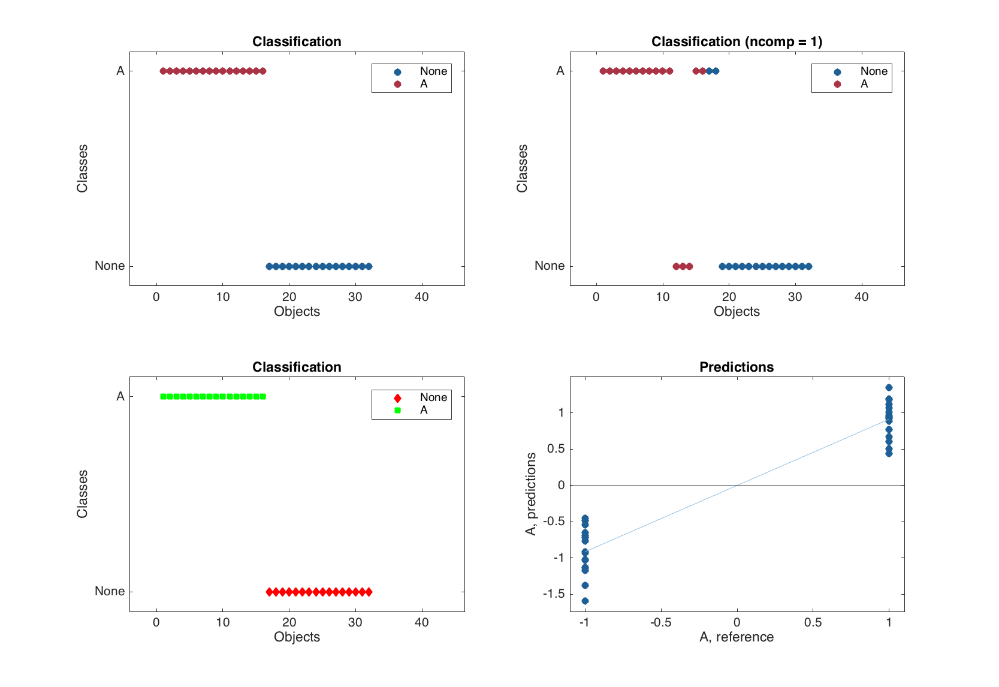

# Discrimination of data with PLS-DA

The PLS regression method, described in the [previous chapter](chapter6/text.md), can also be used for classification (or, more precise, *discrimination*) of multivariate data. The general idea is rather simple:

1. Use a categorical binary variable, which have values +1 for objects, belonging to a particular class, and –1 for objects, which are not from the class, as a response in calibration set.
2. Create a PLS-regression model as usual, using the response values defined above.
3. Make predictions. If a predicted response value is above or equal to 0, the corresponding object is considered to be from the class, if not, the object is rejected as not the class member.

So in fact PLS-DA is a PLS with an extra step — classification by using a threshold for predicted y-values. It means that a PLS-DA model as well as PLS-DA results inherit all methods and properties from the conventional PLS objects. In this chapter we will thefroe focusing on the extra options and methods, available exclusively for PLS-DA.

It must be noted that PLS-DA in general supports multiclass classification, when one provide the binary values in several columns (one for each class). However it is not recommended to do it (see e.g. explanation here) and better create several one-class PLS-DA models instead of one for multiple classes. 

## Calibration of PLS-DA model

The biggest difference with PLS here is how to provide proper values for responses. There are two possibilities. First, is to use a dataset with single factor column and specify either a level number or a label for the level as a class name. Second is to provide a vector with logical values (true for class members and false for strangers) and a class name. In the code below we create PLS-DA models for discrimination between Scandinavians and the others (in our case Mediterraneans, since we do not have any other regions) in the *People* data. 

First we need to load the dataset.
```matlab
load('people')
```

Here is how to create the model using factors
```matlab
X = copy(people);
X.removecols(:, 'Region');

c = people('Region');
c.factor(1, {'A', 'B'});

m1 = mdaplsda(X, c, 'A', 3, 'Scale', 'on');
```

And here how to do the same using logical values.
```matlab
X = copy(people);
X.removecols('Region');

c = people(:, 'Region') == -1;

m1 = mdaplsda(X, c, 'A', 3, 'Scale', 'on');
```

The result will be absolutely the same. It makes sense to use the first way if a factor is already exists and contains several levels (and level names). In this case it is important that the provided class name is identical to one of the level names.

## Exploring PLS-DA results

As it was mentioned already, both model and result object have all methods and properties inherited from corresponding PLS object and then a bit on top of it. Let us look at the differences for the result object first.

In addition to an array with predicted response valyes, `ypred`, in PLS-DA result object there is also an array with predicted class values, `cpred`. In the example below we show both for the case when three components were used in the model (we will use `m1` calculated using the code above).

```matlab
show([m1.calres.ypred(1:end, 1, 3) m1.calres.cpred(1:end, 1, 3)])
```
```
Responses
                 A  VA
           ------- ---
      Lars    1.07   1
     Peter   0.676   1
    Rasmus    0.51   1
      Lene   0.939   1
     Mette    1.01   1
     Gitte    1.12   1
      Jens    1.19   1
      Erik    1.18   1
     Lotte   0.886   1
     Heidi   0.921   1
       Kaj    1.35   1
     Gerda   0.772   1
      Anne   0.445   1
    Britta   0.609   1
    Magnus    0.95   1
    Casper   0.972   1
      Luka  -0.695  -1
  Federico  -0.716  -1
      Dona  -0.653  -1
  Fabrizia   -1.59  -1
      Lisa  -0.488  -1
    Benito  -0.927  -1
    Franko   -1.03  -1
Alessandro  -0.915  -1
   Leonora  -0.449  -1
  Giuliana  -0.769  -1
  Giovanni   -1.02  -1
  Leonardo   -1.14  -1
     Marta  -0.539  -1
   Rosetta   -1.13  -1
     Romeo   -1.38  -1
    Romina   -1.17  -1
```

As one can see all negative predictions were classified as –1 and all positives as +1. The performance statistics of any classification model is based on the following values:

|Name|Description|
|----|-----------|
|FN| Number of false negatives (class members that were incorrectly rejected by a model).|
|TN| Number of true negatives (class non-members that were correctly rejected by a model).|
|FP| Number of false positives (class non-members that were incorrectly accepted by a model).|
|TP| Number of true positives (class members that were correctly accepted by a model).|
|Sensitivity| TP / (TP + FN).|
|Specificity| TN / (FP + TN).|
|Misclassified| (FN + FP) / (FN + TN + FP + TP).|

All statistics are stored in the same structure as for PLS.

```matlab
disp(m1.calres.stat)
```
```
             rmse: [3x1 mdadata]
             bias: [3x1 mdadata]
            slope: [3x1 mdadata]
               r2: [3x1 mdadata]
              rpd: [3x1 mdadata]
               fp: [3x1 mdadata]
               fn: [3x1 mdadata]
               tp: [3x1 mdadata]
      sensitivity: [3x1 mdadata]
      specificity: [3x1 mdadata]
    misclassified: [3x1 mdadata]
```

And these values complement the conventional PLS performance statistics, such as RMSE, bias and so on. The function `summary()` shows most of them for the all components used in the model.

```matlab
summary(m1)
```
```
Results for calibration set

Classification performance for A:
        X expvar  Y expvar  FN  FP   Sens   Spec    Mis
       --------- --------- --- --- ------ ------ ------
Comp 1        44        55   3   2  0.812  0.867  0.156
Comp 2      26.3      34.2   0   0      1      1      0
Comp 3      12.7      2.04   0   0      1      1      0
```

So one can see that with two components the classification performance for calibration set was already good enough.

There are also several additional plots for PLS-DA results (and actually for any other object containg result from a classification method).

|Method|Description|
|------|-----------|
|`plotclassification(obj, ...)`|Shows a classification plot.|
|`plotmisclassified(obj, ...)`|Show a ratio of misclassified objects vs. number of components.|
|`plotsensitivity(obj, ...)`|Show sensitivity vs. number of components.|
|`plotspecificity(obj, ...)`|Show specificity vs. number of components.|

The classification plot shows results of classification using color grouped scatter plot and can be tuned correspondingly. Similar to the `plotprediction()` one can specify number of response variable (in this case always 1 as we have one class classifier) and number of components to show the classification results for. Here are some examples.

```matlab
figure
subplot 221
plotclassification(m1.calres)
subplot 222
plotclassification(m1.calres, 1, 1)
subplot 223
plotclassification(m1.calres, 'Color', 'rg', 'Marker', 'ds')
subplot 224
plotpredictions(m1.calres)
line(xlim(), [0 0], 'Color', 'k')
```



The bottom right plot in the figure above is a normal PLS predictions plot with added horizontal line, which correspond to the threshold used for classification.

The other three plots mentioned in the table, show the corresponding statistics depending on number of components in PLS-DA model, similar to e.g. `plotrmse()` in PLS. As it was already mentioned and also shown in the example below, the conventional PLS plots are also available.

```matlab
figure
subplot 221
plotsensitivity(m1.classres)
subplot 222
plotspecificity(m1.classres)
subplot 223
plotmisclassified(m1.classres)
subplot 224
plotrmse(m1.classres)
```


